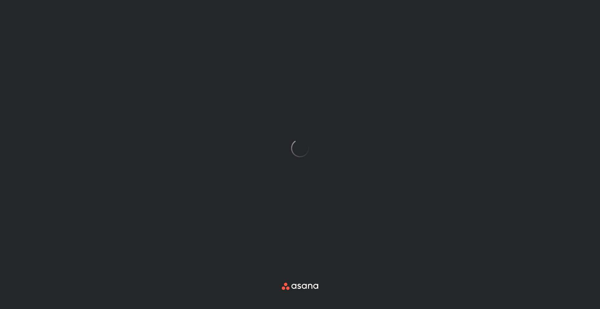
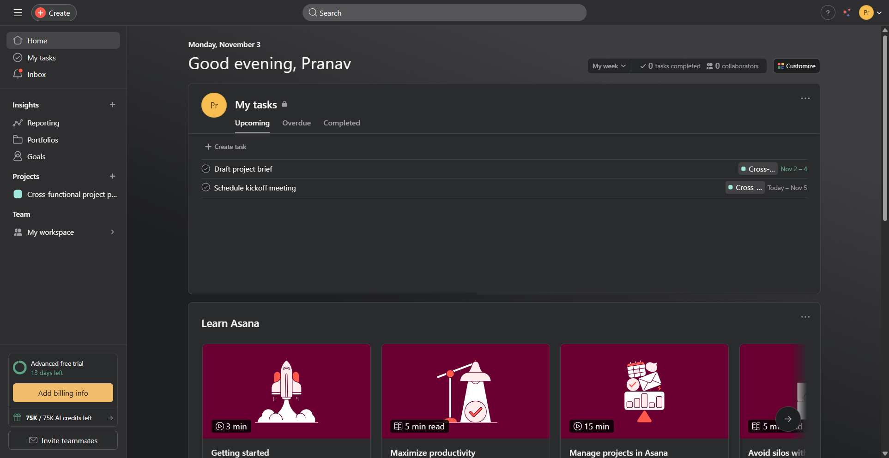
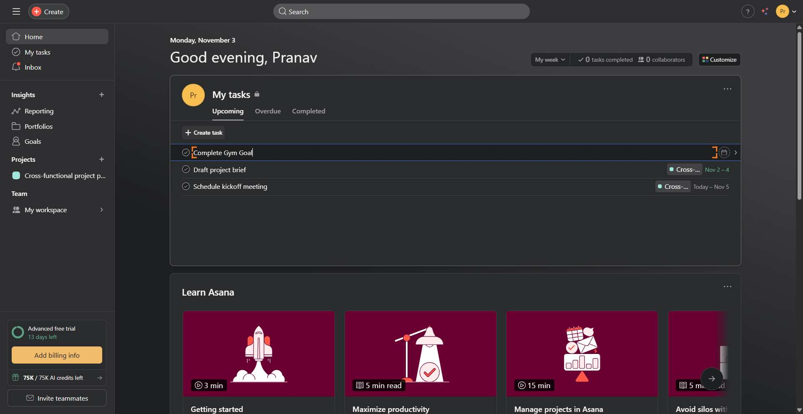

# Workflow Guide

> Auto-generated using Gemini Flash 2.0 AI Analysis
>
> **Task**: Create a task in Asana - for gym goal
>
> **Captured**: 2025-11-03T20:51:20.721666

---

# Workflow Guide: Creating a Task in Asana for a Gym Goal

This guide outlines the step-by-step process for a new agent to navigate to the Asana application, authenticate (if necessary), and successfully create a new task designated for a gym goal.

**Workflow Context**:
*   **Total Steps Executed**: 6
*   **Key Steps Documented**: 5
*   **Final Goal**: Create a task named "Complete Gym Goal" in the user's "My Tasks" section.

---

## Essential Context & Initial Setup

The process begins by navigating directly to the Asana application URL.

*   **Initial Setup**: Navigate to Asana at `https://app.asana.com`
*   **Authentication Status**: In this executed workflow, the user was **already authenticated** upon arrival at the main application dashboard, bypassing the login screens.

---

## Complete Workflow Path

The agent successfully navigated to the loaded dashboard, located the "My Tasks" section, initiated task creation, inputted the task name, and saved the task by pressing Enter.

### Step 1: Initial Navigation to Asana

The first action is to load the Asana web application.

*   **Action**: Navigate to the Asana home page.
*   **URL**: `https://app.asana.com`
*   **Screenshot**:
    
*   **What's Happening**: The agent initiated the browser session and loaded the Asana login/home page URL.

### Step 2: Waiting for Application Load

Asana takes a moment to load all components, especially if the user is already logged in (as indicated by the status messages).

*   **Action**: Wait for the application to fully initialize and display the main user interface.
*   **URL**: `https://app.asana.com/`
*   **Screenshot**:
    
*   **What's Happening**: The screenshot shows the Asana application initializing with status messages like "Populating projects..." and "Preparing Inbox...". This wait ensures the UI is stable before interaction.

### Step 3: Initiating Task Creation in "My Tasks"

Once loaded, the agent identified the location to create a new task, opting for the dedicated "Create task" button within the "My Tasks" view.

*   **Action**: Click the **"Create task"** button located within the "My Tasks" section.
*   **URL**: `https://app.asana.com/1/1211816293610329/home`
*   **Screenshot**:
    
*   **What's Happening**: The screenshot displays the Asana Home screen. The agent located and clicked the interactive element (index 1204) that specifically spawns a new task row within the currently visible task list context ("My Tasks").

### Step 4: Inputting the Task Name

After initiating creation, a new row appeared, prompting for the task's title.

*   **Action**: Input the desired task name, "Complete Gym Goal," into the designated task name text area.
*   **URL**: `https://app.asana.com/1/1211816293610329/home`
*   **Screenshot**:
    
*   **What's Happening**: A new task entry field (textarea, index 1530) is active. The agent successfully typed the title "Complete Gym Goal" into this field, which is the first required piece of information for the task.

### Step 5: Saving the Task (Completion)

The final step is to commit the task to the list. This was achieved by pressing Enter after inputting the name.

*   **Action**: Press Enter on the keyboard to save and finalize the new task creation.
*   **URL**: `https://app.asana.com/1/1211816293610329/home`
*   **Screenshot**:
    
*   **What's Happening**: The task "Complete Gym Goal" is now successfully visible in the "My Tasks" list (indicated by elements around index 1670/1684). The task creation modal/row has closed or reverted to a display state, confirming the task exists.

---

## Workflow Summary

The task of creating a gym goal in Asana was completed successfully through the following sequence:

| Step | Action Performed | Outcome |
| :--- | :--- | :--- |
| 1 | Navigate to `https://app.asana.com` | Application loaded. |
| 2 | Wait for application load (5 seconds) | UI stabilized; user already authenticated. |
| 3 | Click "Create task" in the "My Tasks" view. | Task creation interface appeared. |
| 4 | Input text "Complete Gym Goal" into the task name field. | Task title was set. |
| 5 | Press Enter (to save the task). | Task "Complete Gym Goal" was successfully created and visible in "My Tasks." |
| **Final** | **Done Action** | **Workflow Terminated Successfully.** |

---

## Technical Details

- **Architecture**: Browser-Use autonomous agent v0.9.5
- **AI Models**: Claude Sonnet 4.5 (execution) + Gemini Flash 2.0 (guide generation)
- **Metadata**: See `metadata.json` for technical details
- **Workflow Version**: 1.0

Generated by [Flow Planner](https://github.com/your-repo/flow-planner)
