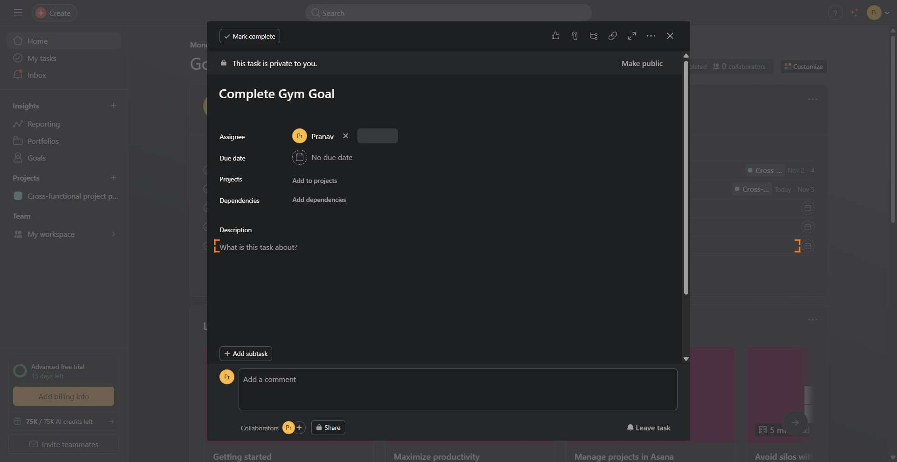
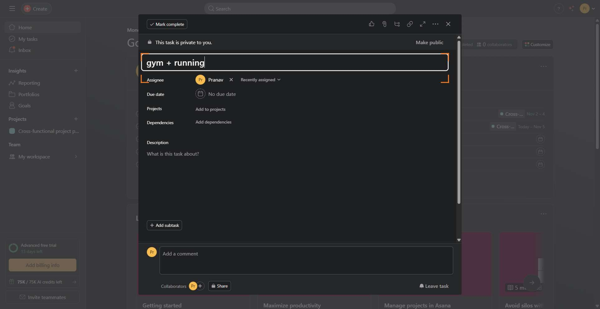

# Workflow Guide

> Auto-generated using Gemini Flash 2.0 AI Analysis
>
> **Task**: On asana, I have a task about gym. Rename it to add gym + running
>
> **Captured**: 2025-11-03T21:23:30.152890

---

# Workflow Guide: Renaming an Asana Task

This guide details the steps required to locate an existing task in Asana and rename it according to the user's request.

**Original Task**: On Asana, rename a task about the gym to **gym + running**.
**Total Steps Documented**: 6
**Key Steps to Document**: 4

---

## Essential Context

1.  **Initial Setup**: The workflow begins by navigating to the Asana application.
    *   Navigate to **Asana** at `https://app.asana.com`.
    *   *Note: The execution logs indicate the user was already authenticated upon navigation.*

---

## Complete Workflow Path

This workflow navigates the user from the Asana Home page, locates the specific task, opens the edit interface, and saves the new name.

### Step 1: Navigate to Asana Home Page

*   **Step Number**: 1
*   **Action**: Navigate to the Asana URL.
*   **URL**: `https://app.asana.com`
*   **What's Happening**: The agent loaded the main Asana application interface. (No screenshot captured for initial navigation.)

### Step 2: Locate and Open the Gym Task

*   **Step Number**: 2
*   **Action**: Click on the task titled "Complete Gym Goal" (found in the "My tasks" section) to open its details panel.
*   **URL**: `https://app.asana.com/1/1211816293610329/home`
*   **What's Happening**: The agent successfully located the target task ("Complete Gym Goal") and clicked it, which triggered the display of the task details modal/sidebar.
    

### Step 3: Prepare to Edit the Task Name (Implicit Step)

*(Note: Step 3 was skipped in the original execution log but is covered implicitly by the actions in Step 4)*

### Step 4: Input the New Task Name

*   **Step Number**: 4
*   **Action**: Click on the task name field (textarea) and input the new desired title: "gym + running".
*   **URL**: `https://app.asana.com/0/home/1211816293610350/1211831595395706`
*   **What's Happening**: The agent clicked the editable task name field (index 1276) within the open task detail panel and typed the required text, "gym + running". This step sets up the final save action.
    

### Step 5: Save the Renamed Task (Implicit Step)

*(Note: Step 5 was skipped in the original execution log, as the final input action in Step 4 was followed immediately by pressing Enter to save, which is detailed in the evaluation of Step 6.)*

### Step 6: Confirm and Complete the Task

*   **Step Number**: 6
*   **Action**: The task name change was automatically saved (likely by pressing Enter after input in Step 4). The workflow confirms the name has been updated.
*   **URL**: `https://app.asana.com/0/home/1211816293610350/1211831595395706`
*   **What's Happening**: The agent verified that the task name is now "gym + running" across the task detail panel, the task list, and the browser tab title. The workflow execution concludes successfully. (No screenshot captured for final confirmation/done action.)

---

## Workflow Summary

The gym task was successfully located on the Asana Home page, opened in its detail view, and renamed from "Complete Gym Goal" to **"gym + running"**. The change was confirmed as saved and the workflow completed.

---

## Technical Details

- **Architecture**: Browser-Use autonomous agent v0.9.5
- **AI Models**: Claude Sonnet 4.5 (execution) + Gemini Flash 2.0 (guide generation)
- **Metadata**: See `metadata.json` for technical details
- **Workflow Version**: 1.0

Generated by [Flow Planner](https://github.com/your-repo/flow-planner)
