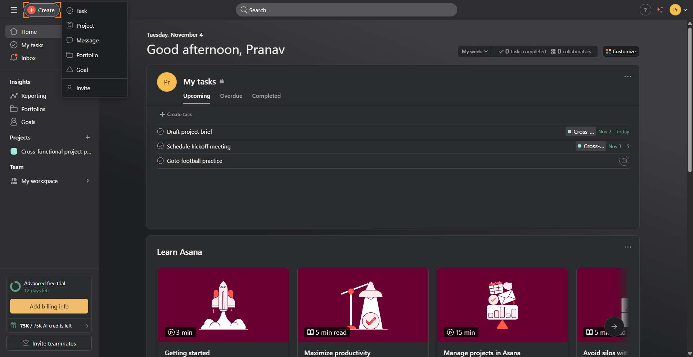
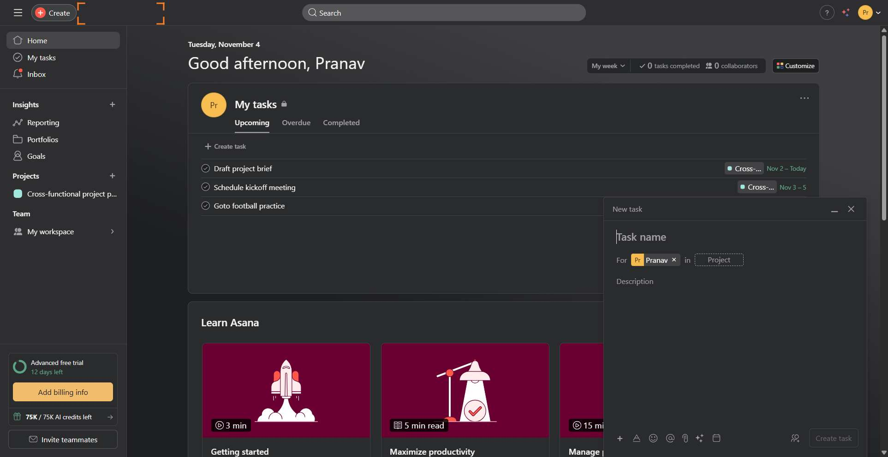
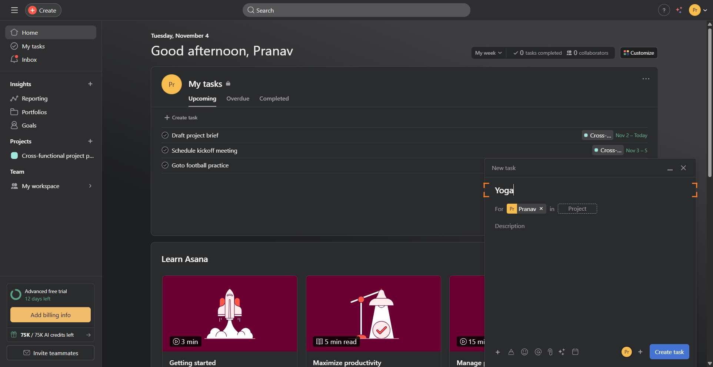
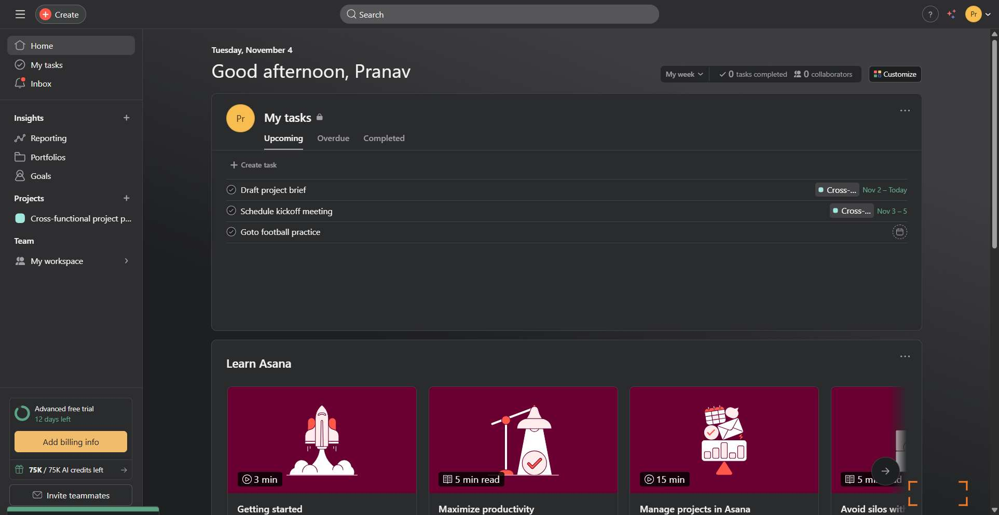

# Workflow Guide

> Auto-generated using Gemini Flash 2.0 AI Analysis
>
> **Task**: Create a task for yoga on Asana
>
> **Captured**: 2025-11-04T13:20:47.798180

---

## Essential Context

### Initial Setup
- **Application**: Asana
- **Starting URL**: `https://app.asana.com/1/1211816293610329/home`
- **Authentication**: Already logged in (persistent session detected)

### Complete Workflow Path
1. Click the "Create" button in the header.
2. Select the "Task" option from the resulting dropdown menu.
3. Input "Yoga" as the task name in the creation modal.
4. Click the "Create task" button to finalize the task.

---

## Detailed Workflow Steps

### Step 1: Click the Create Button

- **Action**: Click the "Create" button in the header.
- **URL**: `https://app.asana.com/1/1211816293610329/home`
- **Screenshot**: 

### Step 2: Select Task Option

- **Action**: Click the "Task" menu item in the dropdown menu.
- **URL**: `https://app.asana.com/1/1211816293610329/home`
- **Screenshot**: 

### Step 3: Input Task Name

- **Action**: Type "Yoga" into the task name input field.
- **URL**: `https://app.asana.com/1/1211816293610329/home`
- **Screenshot**: 

### Step 4: Create the Task

- **Action**: Click the "Create task" button to finalize the task creation.
- **URL**: `https://app.asana.com/1/1211816293610329/home`
- **Screenshot**: 

---

## Workflow Summary

The task creation process for a yoga task on Asana was executed successfully. The agent initiated task creation via the main header button, selected the Task type, entered "Yoga" as the title in the modal, and clicked the final "Create task" button to save the new item.

- **Total Steps**: 4
- **Key Actions**: Click Create, Select Task, Input Title, Click Create Task

---

## Technical Details

- **Architecture**: Browser-Use autonomous agent v0.9.5
- **AI Models**: Claude Sonnet 4.5 (execution) + Gemini Flash 2.0 (guide generation)
- **Metadata**: See `metadata.json` for technical details
- **Workflow Version**: 1.0

Generated by [Flow Planner](https://github.com/your-repo/flow-planner)
