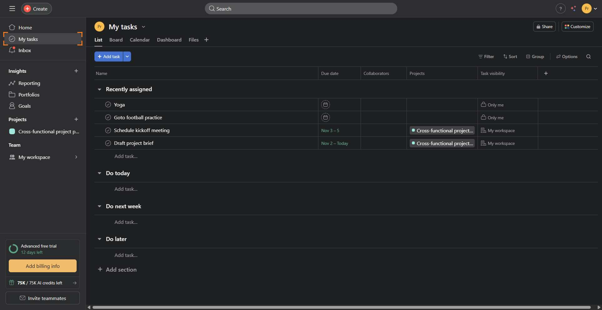
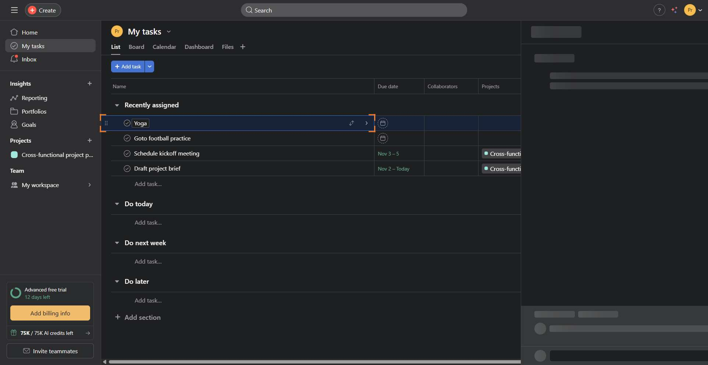
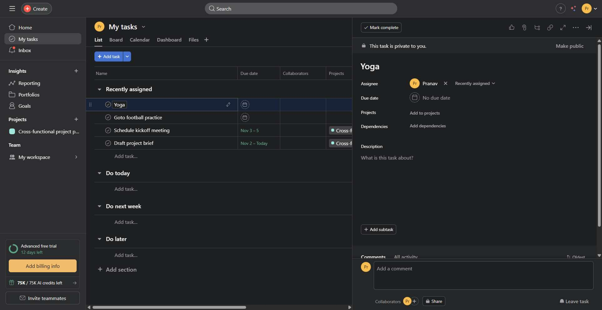
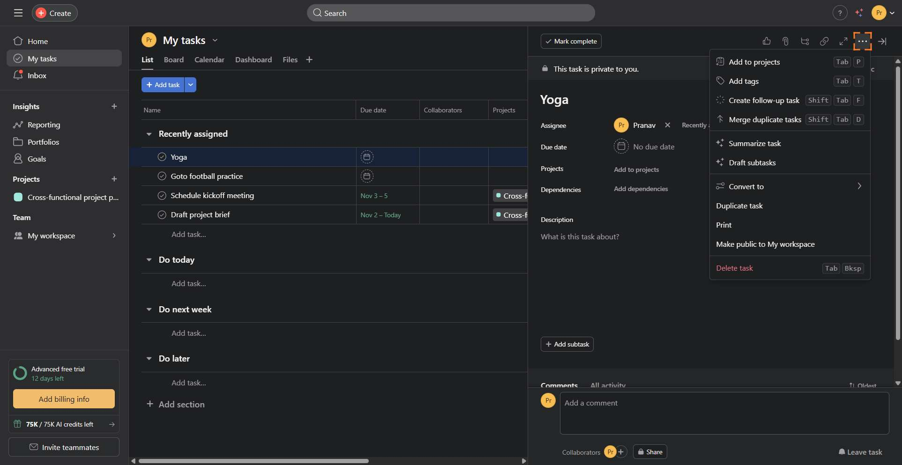
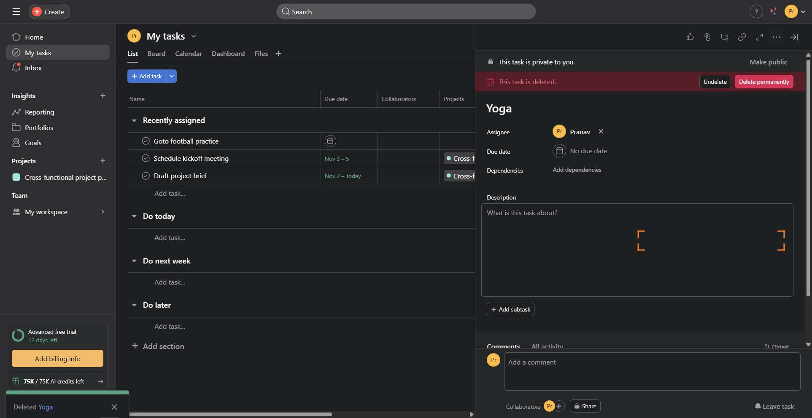
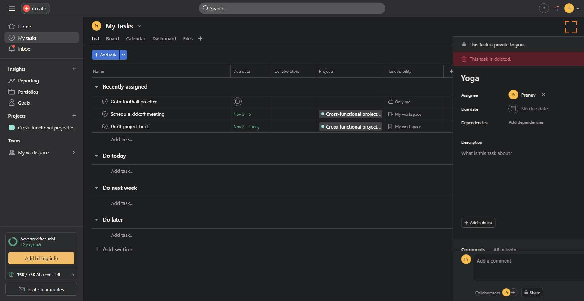

# Workflow Guide

> Auto-generated using Gemini Flash 2.0 AI Analysis
>
> **Task**: Delete a task of Yoga from Asana
>
> **Captured**: 2025-11-04T13:54:07.114610

---

## Essential Context

### Initial Setup
- **Application**: Asana
- **Starting URL**: `https://app.asana.com/1/1211816293610329/home`
- **Authentication**: Already logged in (persistent session detected)

### Complete Workflow Path
1. Navigate to the Asana home page.
2. Click on "My tasks" to view personal tasks.
3. Locate and click on the "Yoga" task to open its detail pane.
4. Click the "Details" button to fully expand the task pane.
5. Click the "More actions" button within the task detail pane.
6. Select "Delete task" from the overflow menu.
7. Close the task detail pane after successful deletion.

---

## Detailed Workflow Steps

### Step 1: Navigate to My Tasks

- **Action**: Click the "My tasks" navigation link.
- **URL**: `https://app.asana.com/1/1211816293610329/home`
- **Screenshot**: 

### Step 2: Click the Yoga Task

- **Action**: Click the "Yoga" task entry in the task list.
- **URL**: `https://app.asana.com/1/1211816293610329/project/1211816294325882/list/1211816294699921`
- **Screenshot**: 

### Step 3: Open Full Task Details

- **Action**: Click the "Details" button associated with the task.
- **URL**: `https://app.asana.com/1/1211816293610329/project/1211816294325882/task/1211840427239169`
- **Screenshot**: 

### Step 4: Open More Actions Menu

- **Action**: Click the "More actions" button for this task.
- **URL**: `https://app.asana.com/1/1211816293610329/project/1211816294325882/task/1211840427239169`
- **Screenshot**: 

### Step 5: Initiate Task Deletion

- **Action**: Click the "Delete task" menu item.
- **URL**: `https://app.asana.com/1/1211816293610329/project/1211816294325882/task/1211840427239169`
- **Screenshot**: 

### Step 6: Close Task Details Pane

- **Action**: Click the "Close details" button to exit the task pane.
- **URL**: `https://app.asana.com/1/1211816293610329/project/1211816294325882/task/1211840427239169`
- **Screenshot**: 

---

## Workflow Summary

The agent successfully logged into Asana, navigated to "My tasks," located the "Yoga" task, and opened its detail pane. The agent then accessed the "More actions" menu, selected "Delete task," confirming the deletion via the resulting notification. Finally, the task detail pane was closed, completing the task deletion request.

- **Total Steps**: 6
- **Key Actions**: Clicked "My tasks," Clicked "Yoga" task, Clicked "Details," Clicked "More actions," Clicked "Delete task," Closed task details.

---

## Technical Details

- **Architecture**: Browser-Use autonomous agent v0.9.5
- **AI Models**: Claude Sonnet 4.5 (execution) + Gemini Flash 2.0 (guide generation)
- **Metadata**: See `metadata.json` for technical details
- **Workflow Version**: 1.0

Generated by [Flow Planner](https://github.com/your-repo/flow-planner)
