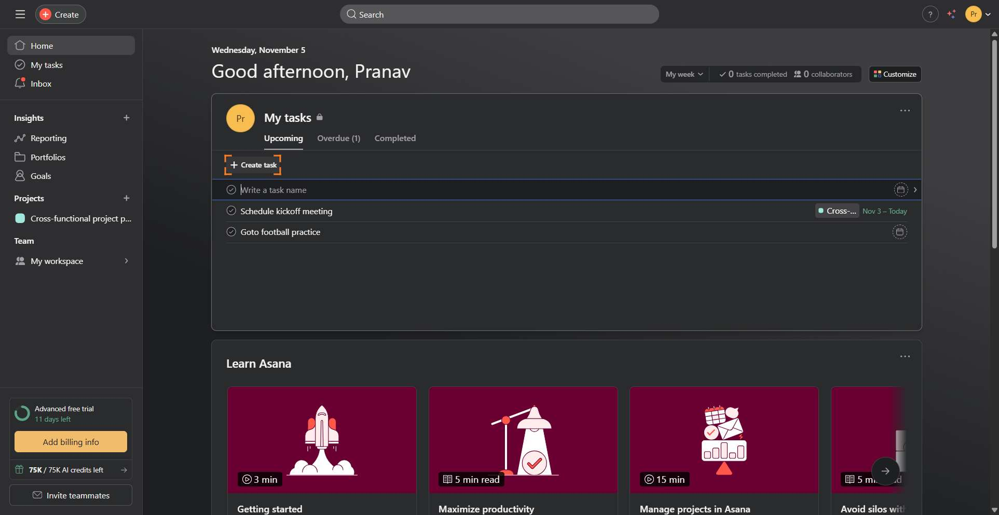
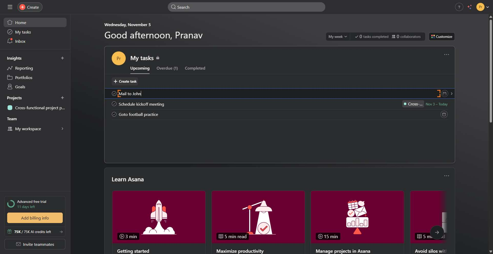

# Workflow Guide

> Auto-generated using Gemini Flash 2.0 AI Analysis
>
> **Task**: create a task on asana for 'Mail to John'
>
> **Captured**: 2025-11-05T16:30:51.266562

---

## Essential Context

### Initial Setup
- **Application**: Asana
- **Starting URL**: `https://app.asana.com/1/1211816293610329/home`
- **Authentication**: Already logged in (persistent session detected)

### Complete Workflow Path
1. Click the "Create task" button in the My tasks section.
2. Input "Mail to John" into the task name field.
3. Confirm task creation (implied by hitting enter/saving after typing).

---

## Detailed Workflow Steps

### Step 1: Click the "Create task" button

- **Action**: Click the "Create task" button labeled element 1161 located in the My tasks section.
- **URL**: `https://app.asana.com/1/1211816293610329/home`
- **Screenshot**: 

### Step 2: Input the task name

- **Action**: Type "Mail to John" into the task name textarea field (element 1540).
- **URL**: `https://app.asana.com/1/1211816293610329/home`
- **Screenshot**: 

---

## Workflow Summary

The task required creating a new item in Asana titled 'Mail to John'. The agent navigated to the home screen, initiated the task creation process within the 'My tasks' section, and successfully entered the required title into the designated input field. The successful completion implies the task creation was finalized upon typing the name (by pressing Enter or equivalent save action, based on the workflow data structure).

- **Total Steps**: 2
- **Key Actions**: Clicked 'Create task' button, Typed task title "Mail to John"

---

## Technical Details

- **Architecture**: Browser-Use autonomous agent v0.9.5
- **AI Models**: Claude Sonnet 4.5 (execution) + Gemini Flash 2.0 (guide generation)
- **Metadata**: See `metadata.json` for technical details
- **Workflow Version**: 1.0

Generated by [Flow Planner](https://github.com/your-repo/flow-planner)
