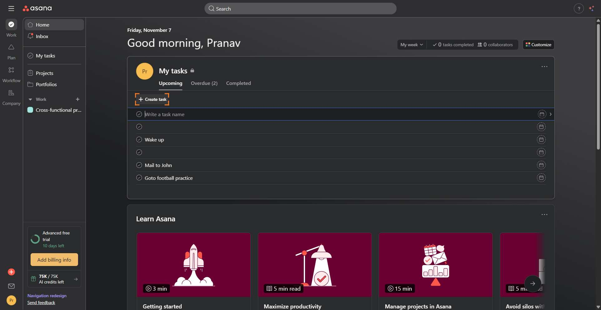
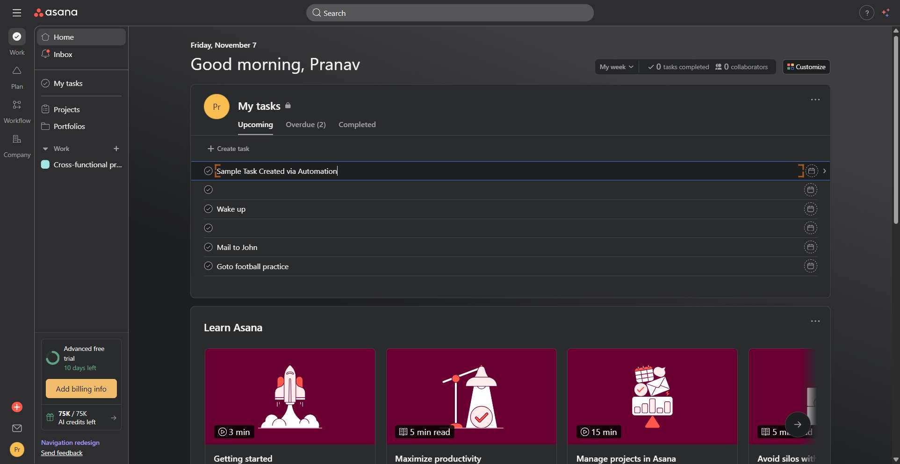
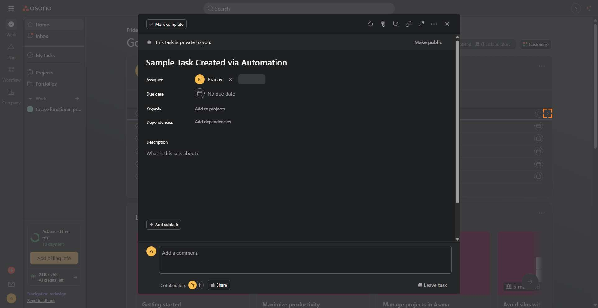
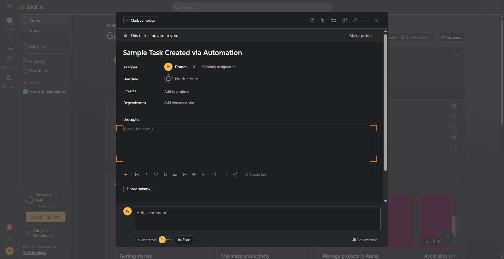
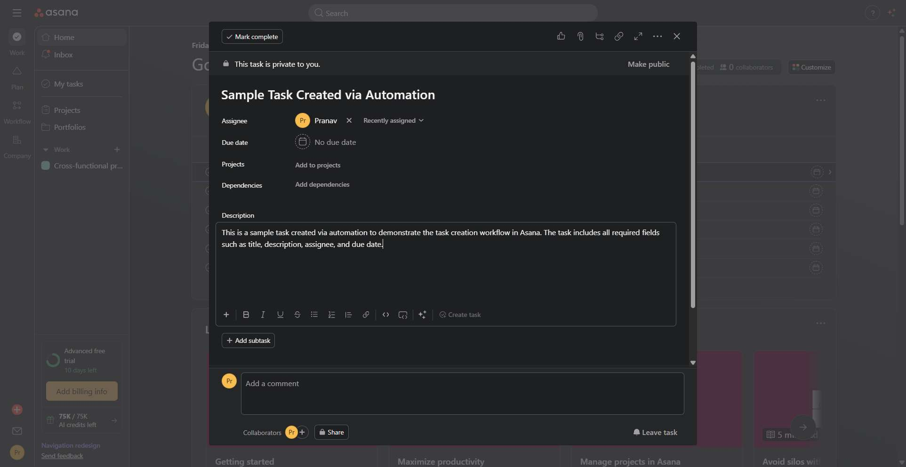
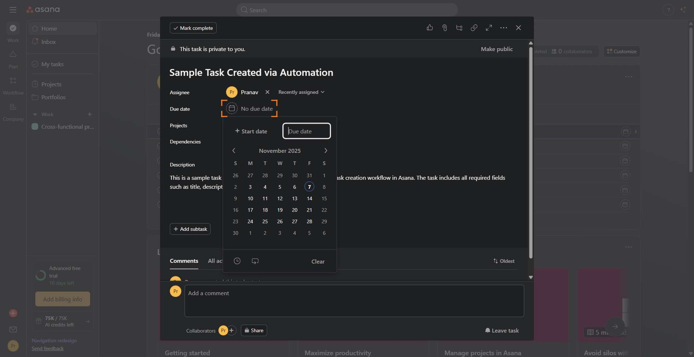
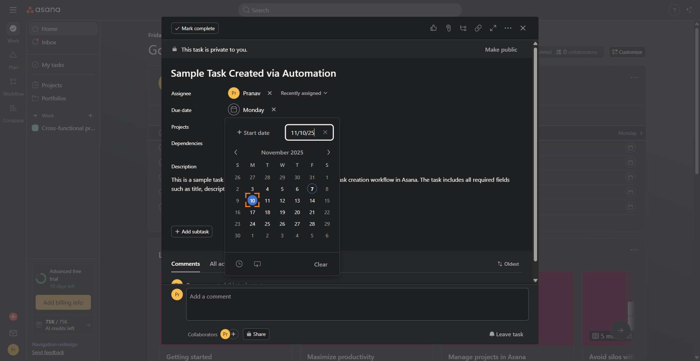

# Workflow Guide

> Auto-generated using Gemini Flash 2.0 AI Analysis
>
> **Task**: Create a task on Asana
>
> **Captured**: 2025-11-07T00:44:20.664755

---

## Essential Context

### Initial Setup
- **Application**: Asana
- **Starting URL**: `https://app.asana.com/1/1211816293610329/home`
- **Authentication**: Already logged in (persistent session detected)

### Complete Workflow Path
1. Navigate to the Asana home page.
2. Click the "Create task" button.
3. Type the task name in the resulting input field.
4. Click the "Details" button within the task creation inline form.
5. Press Enter to confirm and open the full task detail pane.
6. Click into the description area of the task detail pane.
7. Type the task description.
8. Click the "Due date" button.
9. Select November 10th from the calendar date picker.
10. Verify the task details are populated and the task is created.

---

## Detailed Workflow Steps

### Step 1: Navigate to Asana Home Page

- **Action**: Navigate to the Asana application URL
- **URL**: `https://app.asana.com/1/1211816293610329/home`

### Step 2: Click the "Create task" Button

- **Action**: Click the div with role="button" labeled "Create task"
- **URL**: `https://app.asana.com/1/1211816293610329/home`
- **Screenshot**: 

### Step 3: Type the Task Name

- **Action**: Type "Sample Task Created via Automation" into the task name textarea
- **URL**: `https://app.asana.com/1/1211816293610329/home`
- **Screenshot**: 

### Step 4: Click the "Details" Button

- **Action**: Click the div with role="button" labeled "Details" inside the inline task creation form
- **URL**: `https://app.asana.com/1/1211816293610329/home`
- **Screenshot**: 

### Step 5: Press Enter to Open Full Task Detail Pane

- **Action**: Press the Enter key while focused on the task creation element to finalize the title and open the task details view
- **URL**: `https://app.asana.com/0/home/1211816293610350/1211872354815032`

### Step 6: Click into the Description Area

- **Action**: Click the div with role="document" labeled "Description" to activate the text editor
- **URL**: `https://app.asana.com/0/home/1211816293610350/1211872354815032`
- **Screenshot**: 

### Step 7: Type the Task Description

- **Action**: Type "This is a sample task created via automation to demonstrate the task creation workflow in Asana. The task includes all required fields such as title, description, assignee, and due date." into the description field
- **URL**: `https://app.asana.com/0/home/1211816293610350/1211872354815032`
- **Screenshot**: 

### Step 8: Click the "Due Date" Button

- **Action**: Click the div with role="button" labeled "No due date" to open the date picker
- **URL**: `https://app.asana.com/0/home/1211816293610350/1211872354815032`
- **Screenshot**: 

### Step 9: Select November 10th from the Calendar

- **Action**: Click the span element labeled "10" within the calendar date picker
- **URL**: `https://app.asana.com/0/home/1211816293610350/1211872354815032`
- **Screenshot**: 

### Step 10: Verify Task Creation Success

- **Action**: Verify that the task detail pane displays the title, description, assignee (Pranav), and a due date of November 10, 2025, confirming task creation completion.
- **URL**: `https://app.asana.com/0/home/1211816293610350/1211872354815032`

---

## Workflow Summary

The agent successfully navigated to the Asana dashboard while already logged in as Pranav. The agent initiated task creation, input a title, opened the details pane, added a description, and set a due date of November 10, 2025, thereby completing all required steps for task creation.

- **Total Steps**: 10
- **Key Actions**: Navigate to Asana, Create Task, Input Title, Input Description, Set Due Date, Verify Completion

---

## Technical Details

- **Architecture**: Browser-Use autonomous agent v0.9.5
- **AI Models**: Claude Sonnet 4.5 (execution) + Gemini Flash 2.0 (guide generation)
- **Metadata**: See `metadata.json` for technical details
- **Workflow Version**: 1.0

Generated by [Flow Planner](https://github.com/your-repo/flow-planner)
