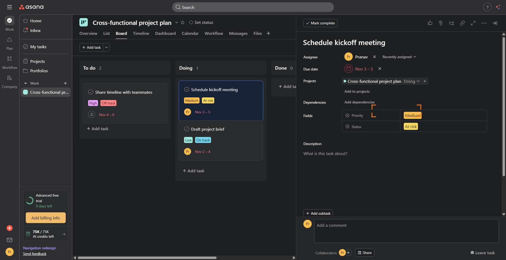

# Workflow Guide

> Auto-generated using Gemini Flash 2.0 AI Analysis
>
> **Task**: How do you move a task to 'In Progress' from 'To do' in Asana
>
> **Captured**: 2025-11-07T13:53:47.541211

---

## Essential Context

### Initial Setup
- **Application**: Asana
- **Starting URL**: `https://app.asana.com/1/1211816293610329/project/1211816294737940/task/1211816294737957`
- **Authentication**: Already logged in (persistent session detected)

### Complete Workflow Path
1. Navigate to the Asana task details URL.
2. Locate the section dropdown displaying the current status ("To do").
3. Click the section dropdown to open the status selector menu.
4. Click the "Doing" option within the status selector menu.
5. Verify the task status updates from "To do" to "Doing" (In Progress).

---

## Detailed Workflow Steps

### Step 1: Navigate to the Asana Task

- **Action**: Navigate browser to the provided URL for the task details view
- **URL**: `https://app.asana.com/1/1211816293610329/project/1211816294737940/task/1211816294737957`

### Step 2: Click the Section Selector Dropdown

- **Action**: Click the button displaying the current section status, which reads "To do"
- **URL**: `https://app.asana.com/1/1211816293610329/project/1211816294737940/task/1211816294737957`

### Step 3: Click the "Doing" Status Option

- **Action**: Click the div role=option "Doing"
- **URL**: `https://app.asana.com/1/1211816293610329/project/1211816294737940/task/1211816294737957`
- **Screenshot**: 

### Step 4: Verify Task Status is "Doing"

- **Action**: Confirm that the task status indicator now displays "Doing" in the task details panel
- **URL**: `https://app.asana.com/1/1211816293610329/project/1211816294737940/task/1211816294737957`

---

## Workflow Summary

The task was moved from the 'To do' section to the 'Doing' section, effectively placing it 'In Progress'. This involved navigating directly to the task, opening the section selector dropdown, and selecting the 'Doing' option to confirm the status change in the Asana interface.

- **Total Steps**: 4
- **Key Actions**: Navigate to task, Click section dropdown, Click "Doing" option, Verify status change.

---

## Technical Details

- **Architecture**: Browser-Use autonomous agent v0.9.5
- **AI Models**: Claude Sonnet 4.5 (execution) + Gemini Flash 2.0 (guide generation)
- **Metadata**: See `metadata.json` for technical details
- **Workflow Version**: 1.0

Generated by [Flow Planner](https://github.com/your-repo/flow-planner)
