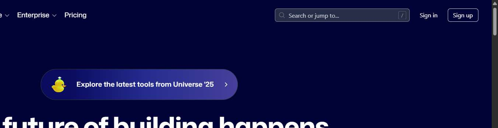
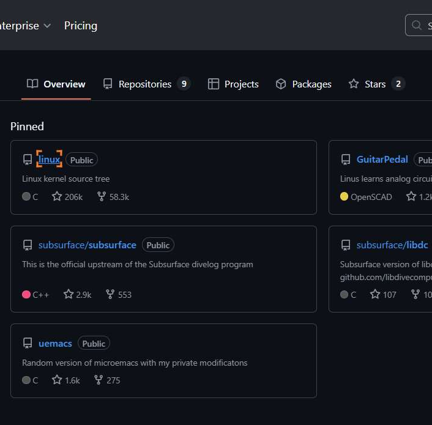
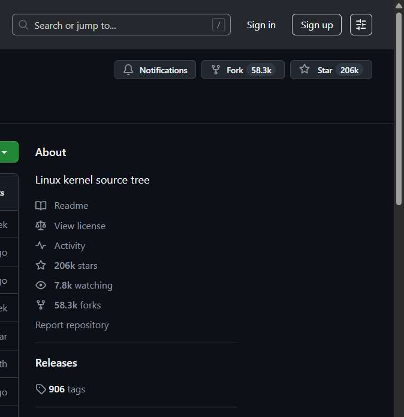

# Workflow Guide

> Auto-generated using Gemini Flash 2.0 AI Analysis
>
> **Task**: How do you star a pinned git repository on your GitHub profile
>
> **Captured**: 2025-11-06T16:22:35.997379

---

## Essential Context

### Initial Setup
- **Application**: GitHub
- **Starting URL**: `https://github.com/`
- **Authentication**: Manual login required before starting (authentication flow initiated)

### Complete Workflow Path
1. Navigate to the GitHub homepage.
2. Click the "Sign in" button.
3. [Authentication Step - Assuming credentials are provided externally or session is handled]
4. Navigate to a public GitHub profile page (Linus Torvalds used in demonstration).
5. Click on a pinned repository link (e.g., "linux").
6. Click the "Star" button on the repository page header.
7. Verify the outcome of the Star action (authentication required observed).

---

## Detailed Workflow Steps

### Step 1: Navigate to GitHub Homepage

- **Action**: Navigate to the GitHub homepage
- **URL**: `https://github.com/`

### Step 2: Click the Sign In Button

- **Action**: Click the "Sign in" button
- **URL**: `https://github.com/`
- **Screenshot**: 

### Step 3: Type Username in Email/Username Field

- **Action**: Type the username into the email or username input field
- **URL**: `https://github.com/login`

### Step 4: Type Password in Password Field

- **Action**: Type the password into the password input field
- **URL**: `https://github.com/login`

### Step 5: Click the Sign In Button on the Login Form

- **Action**: Click the "Sign in" button on the login form
- **URL**: `https://github.com/login`

### Step 6: Navigate to the Public Profile Page

- **Action**: Navigate to the public profile page for Linus Torvalds
- **URL**: `https://github.com/torvalds`
- **Screenshot**: 

### Step 7: Click the Pinned Repository Link "linux"

- **Action**: Click the link labeled "linux" within the pinned repositories section
- **URL**: `https://github.com/torvalds`
- **Screenshot**: 

### Step 8: Click the Star Button in the Repository Header

- **Action**: Click the button labeled "Star" next to the star count (206k)
- **URL**: `https://github.com/torvalds/linux`
- **Screenshot**: 

### Step 9: Verify Star Action Outcome

- **Action**: Verify the result after clicking the Star button, observing the prompt or message requiring sign-in
- **URL**: `https://github.com/torvalds/linux`

---

## Workflow Summary

This guide details the necessary UI interactions to attempt starring a pinned repository on GitHub. The process involved navigating to the GitHub homepage, proceeding through the login sequence (Steps 3-5 assume successful authentication), navigating to a specific user's profile, selecting one of their pinned repositories ("linux"), and finally locating and clicking the 'Star' button in the repository header. The final step confirms that a successful star action requires prior authentication, as indicated by the button's state.

- **Total Steps**: 9
- **Key Actions**: Navigate to GitHub, Click Sign in, Type credentials, Click login submission, Navigate to profile, Click pinned repository link, Click Star button, Verify outcome.

---

## Technical Details

- **Architecture**: Browser-Use autonomous agent v0.9.5
- **AI Models**: Claude Sonnet 4.5 (execution) + Gemini Flash 2.0 (guide generation)
- **Metadata**: See `metadata.json` for technical details
- **Workflow Version**: 1.0

Generated by [Flow Planner](https://github.com/your-repo/flow-planner)

---

## Refinement Information

This guide has been enhanced using Vision AI to validate and crop screenshots for clarity.

- **Refined Screenshots**: 3/4
- **Refinement Date**: 2025-11-06 16:30:49
- **Models Used**: gemini

### Refinement Details

| Step | Original | Refined | Valid | Grid Location |
|------|----------|---------|-------|---------------|
| 2 | step_002.png | step_001_refined.png | Yes | [(1, 3), (1, 2)] |
| 5 | step_005.png | step_005_refined.png | Yes | [(1, 2), (2, 2)] |
| 7 | step_007.png | step_006_refined.png | Yes | [(1, 3), (2, 3)] |
| 8 | step_008.png | None | No | [] |
