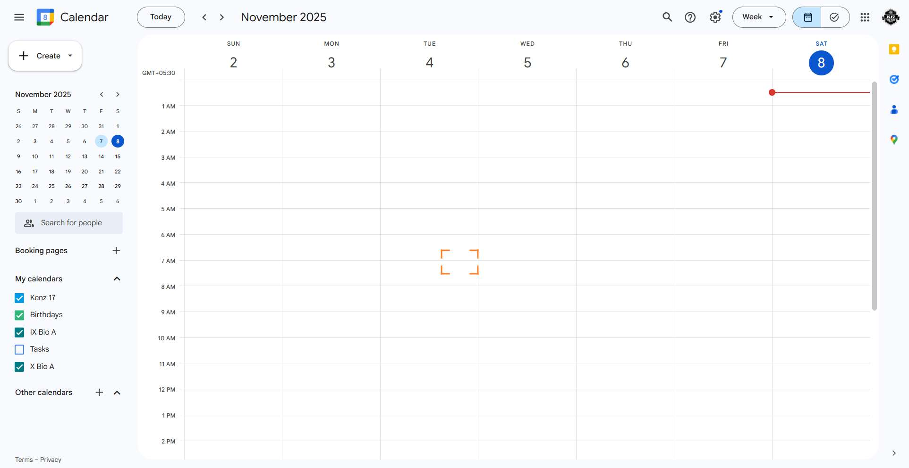
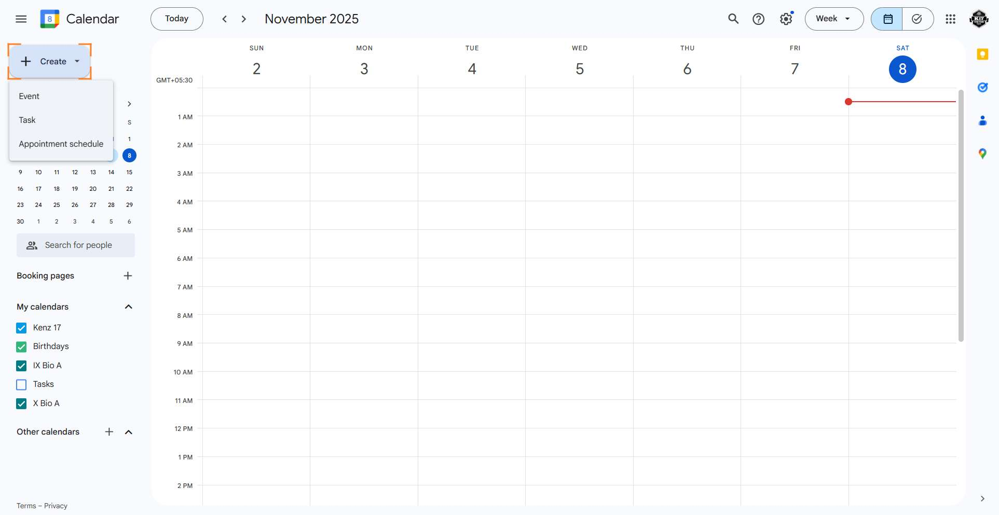
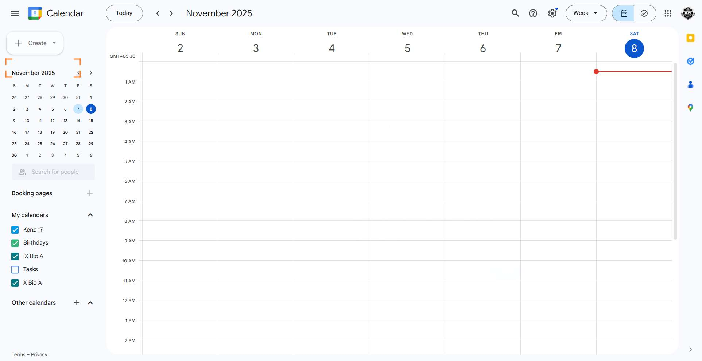
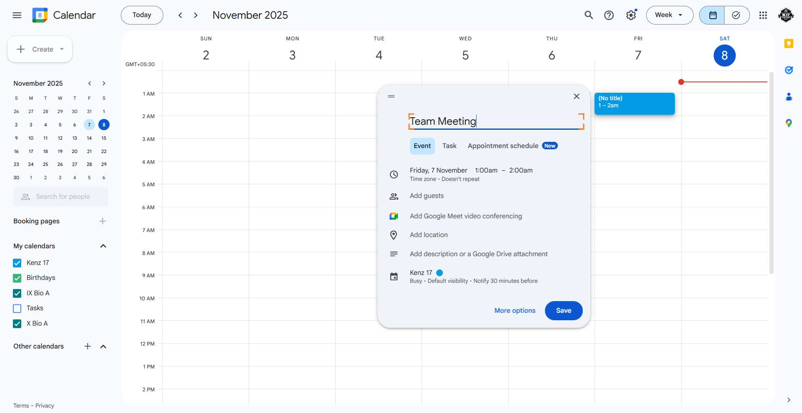
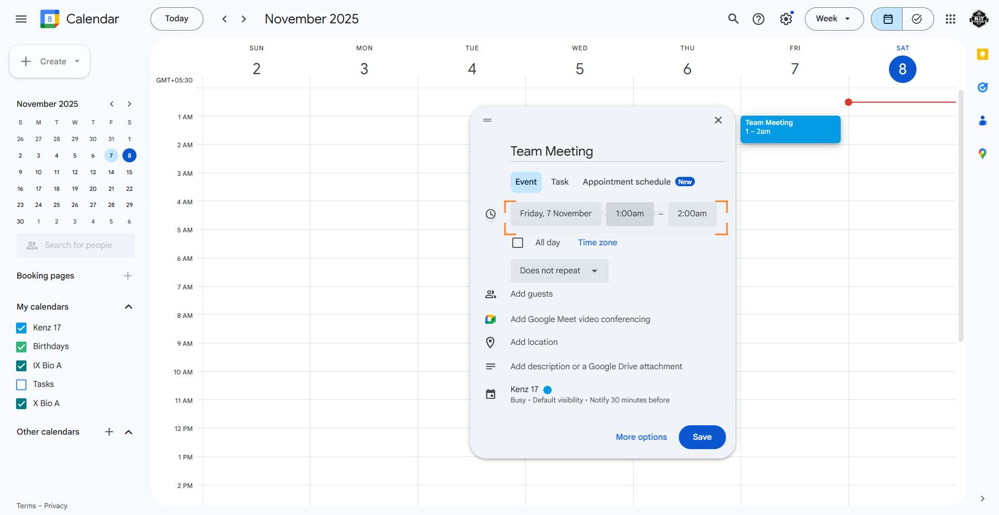
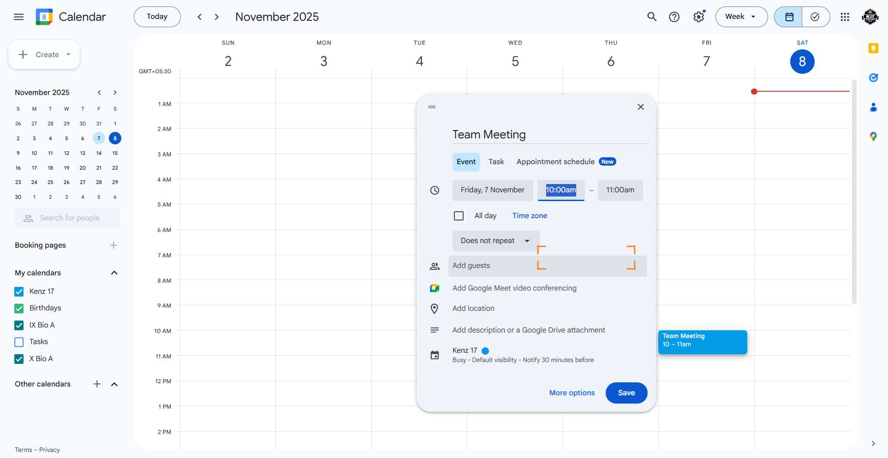
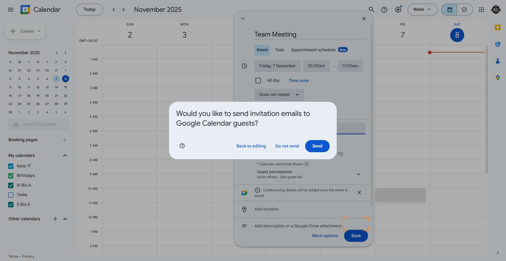
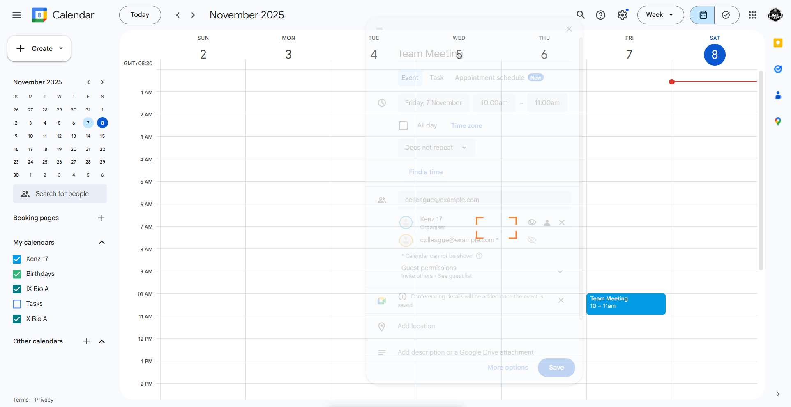

# Workflow Guide

> Auto-generated using Gemini Flash 2.0 AI Analysis
>
> **Task**: How to schedult a meet/reminder on Google calender?
>
> **Captured**: 2025-11-07T14:04:38.634527

---

## Essential Context

### Initial Setup
- **Application**: Google Calendar
- **Starting URL**: `https://calendar.google.com/calendar/u/0/r`
- **Authentication**: Already logged in (persistent session detected)

### Complete Workflow Path
1. Navigate to the Google Calendar URL.
2. Dismiss the timezone dialog prompt by clicking "No".
3. Click the "Create" button to open the event creation menu.
4. Select "Event" from the creation dropdown menu.
5. Input the desired title into the event title field.
6. Click on the start date/time area to open detailed time settings.
7. Input the desired start time into the start time field.
8. Click the selected time option to confirm the new start time.
9. Click the "Add guests" button to reveal the guest input field.
10. Input a sample guest email address into the guest input field.
11. Click the "Save" button to finalize the event details.
12. Click the "Send" button on the invitation confirmation dialog to finalize the event and send invitations.

---

## Detailed Workflow Steps

### Step 1: Navigate to Google Calendar

- **Action**: Navigate the browser to the Google Calendar URL
- **URL**: `https://calendar.google.com/calendar/u/0/r`

### Step 2: Dismiss the Timezone Dialog

- **Action**: Click the button labeled "No" to dismiss the timezone prompt
- **URL**: `https://calendar.google.com/calendar/u/0/r`
- **Screenshot**: 

### Step 3: Initiate Event Creation

- **Action**: Click the "Create" button located in the upper left section of the interface
- **URL**: `https://calendar.google.com/calendar/u/0/r`
- **Screenshot**: 

### Step 4: Select Event Option

- **Action**: Click the menu item labeled "Event" within the creation dropdown menu
- **URL**: `https://calendar.google.com/calendar/u/0/r`
- **Screenshot**: 

### Step 5: Input Event Title

- **Action**: Type "Team Meeting" into the "Add title" input field
- **URL**: `https://calendar.google.com/calendar/u/0/r`
- **Screenshot**: 

### Step 6: Open Detailed Time Settings

- **Action**: Click on the area displaying the current date and time settings to expand the time picker options
- **URL**: `https://calendar.google.com/calendar/u/0/r`
- **Screenshot**: 

### Step 7: Input Desired Start Time

- **Action**: Type "10:00am" into the start time input field
- **URL**: `https://calendar.google.com/calendar/u/0/r`
- **Screenshot**: 

### Step 8: Confirm Start Time Selection

- **Action**: Click the listed option corresponding to "10:00am" to confirm the selection in the time dropdown
- **URL**: `https://calendar.google.com/calendar/u/0/r`
- **Screenshot**: 

### Step 9: Open Guest Addition Field

- **Action**: Click the button labeled "Add guests" within the event creation form
- **URL**: `https://calendar.google.com/calendar/u/0/r`
- **Screenshot**: 

### Step 10: Add Guest Email Address

- **Action**: Type "colleague@example.com" into the guest input field
- **URL**: `https://calendar.google.com/calendar/u/0/r`
- **Screenshot**: 

### Step 11: Initiate Event Saving

- **Action**: Click the "Save" button located at the bottom of the event details form
- **URL**: `https://calendar.google.com/calendar/u/0/r`
- **Screenshot**: 

### Step 12: Send Event Invitation

- **Action**: Click the "Send" button within the dialog prompting to send invitation emails
- **URL**: `https://calendar.google.com/calendar/u/0/r`

---

## Workflow Summary

This guide details the process of scheduling a new meeting on Google Calendar. The process began by navigating to the calendar interface and dismissing a timezone notification. The agent then initiated event creation, set the title to "Team Meeting," adjusted the default time from 1:00am to 10:00am, and added a sample guest email address. Finally, the event was saved, and the system prompt to send invitations was confirmed by clicking "Send," completing the scheduling process.

- **Total Steps**: 12
- **Key Actions**: Navigate, Dismiss Dialog, Click Create, Select Event, Type Title, Adjust Time, Add Guest, Save Event, Send Invitation.

---

## Technical Details

- **Architecture**: Browser-Use autonomous agent v0.9.5
- **AI Models**: Claude Sonnet 4.5 (execution) + Gemini Flash 2.0 (guide generation)
- **Metadata**: See `metadata.json` for technical details
- **Workflow Version**: 1.0

Generated by [Flow Planner](https://github.com/your-repo/flow-planner)
