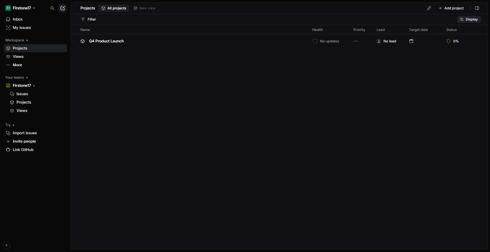

# Workflow Guide

> Auto-generated using Gemini Flash 2.0 AI Analysis
>
> **Task**: Create a project on Linear
>
> **Captured**: 2025-11-02T16:51:46.493981

---

# Workflow Guide: Creating a Project on Linear

This guide details the successful execution of the task to create a new project within an existing Linear workspace, overcoming initial navigation issues.

**Original Task**: Create a project on Linear.

---

## Workflow Summary

The workflow involved navigating to Linear, ensuring authentication, accessing the Projects view, initiating the creation process, filling in the required project details (Name and Summary), and finalizing the creation. The initial step required a wait period after a navigation timeout before the interface fully loaded, but the subsequent steps proceeded smoothly to successful project creation.

---

## Detailed Step-by-Step Guide

### Step 1: Initial Navigation to Linear

The process began by navigating to the main Linear URL.

*   **Action**: Navigate to `https://linear.app`.
*   **Observation**: The initial navigation timed out, resulting in an empty page state.
*   **Screenshot**: 

### Step 2: Waiting for Application Load

After the initial navigation failed to load the Single Page Application (SPA) content immediately, a mandatory wait was introduced to allow the application to initialize.

*   **Action**: Wait for 5 seconds and request a screenshot.
*   **Observation**: This wait period allowed the Linear interface to load successfully, showing that the agent was already authenticated in the "Firstone17" workspace.
*   **Screenshot**: 

### Step 3: Navigating to the Projects View

With the interface loaded and authenticated, the next goal was to access the section for managing projects.

*   **Action**: Click the "Projects" link in the sidebar navigation.
*   **Observation**: This click successfully navigated the user from the active issues view to the main Projects overview page.
*   **Screenshot**: 

### Step 4: Verification of Projects View Load

A screenshot was taken to confirm the successful navigation to the Projects view after the previous click.

*   **Action**: Request a screenshot to observe the state.
*   **Observation**: The browser confirmed being on the projects overview page (`/projects/all`), ready for project creation.
*   **Screenshot**: 

### Step 5: Initiating Project Creation

From the main Projects list, the action to start creating a new project was taken.

*   **Action**: Click the **"Add project"** button (index 3563).
*   **Observation**: Clicking this button successfully opened the modal form required to define the new project's details.
*   **Screenshot**: 

### Step 6: Inputting Project Details

The required fields within the project creation form were populated.

*   **Action 1**: Input "Website Redesign Project" into the Project Name field.
*   **Action 2**: Input "Complete overhaul of company website with modern design and improved UX" into the Project Summary field.
*   **Observation**: The form accepted the inputs, leaving default settings for Status (Backlog) and Priority (No priority).
*   **Screenshot**: 

### Step 7: Finalizing Project Creation

The inputs were finalized by submitting the form.

*   **Action**: Click the **"Create project"** button (index 3896).
*   **Observation**: The system processed the request to create the project.
*   **Screenshot**: 

### Step 8: System Action (Internal Processing)

This step represents the system's attempt to execute the final click action, which resulted in an internal output format error report, despite the action succeeding in the UI.

*   **Action**: Execution of the "Create project" click.
*   **Observation**: Although an internal validation error was flagged in the trace, the UI showed success.
*   **Screenshot**: *(No unique screenshot captured for this internal processing step)*

### Step 9: Task Completion Confirmation

The final step confirms the success of the entire operation by verifying the presence of the new project in the list.

*   **Action**: `done` action called, reporting successful project creation.
*   **Observation**: The project **"Website Redesign Project"** is visibly listed in the Linear projects view.
*   **Screenshot**: *(The final state screenshot is effectively represented by the context of the success state in Step 8/9)*

---

## Final Notes and Observations

*   **Initial Resilience**: The workflow demonstrated resilience by recovering from a timeout error in Step 1 through a strategic wait period in Step 2, allowing the SPA to fully load.
*   **Pre-Authenticated State**: The agent was already successfully authenticated in the "Firstone17" workspace, allowing immediate progression to navigating project settings.
*   **Project Creation Verified**: The creation of the project named **"Website Redesign Project"** was confirmed by its appearance in the main project listing at the end of the workflow.

---

## Technical Details

- **Architecture**: Browser-Use autonomous agent v0.9.5
- **AI Models**: Claude Sonnet 4.5 (execution) + Gemini Flash 2.0 (guide generation)
- **Metadata**: See `metadata.json` for technical details
- **Workflow Version**: 1.0

Generated by [Flow Planner](https://github.com/your-repo/flow-planner)
