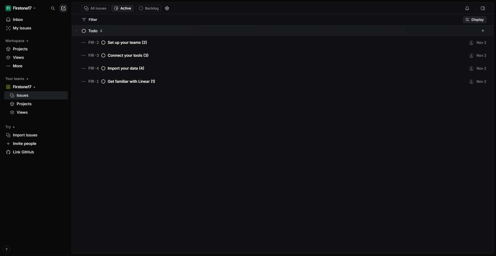
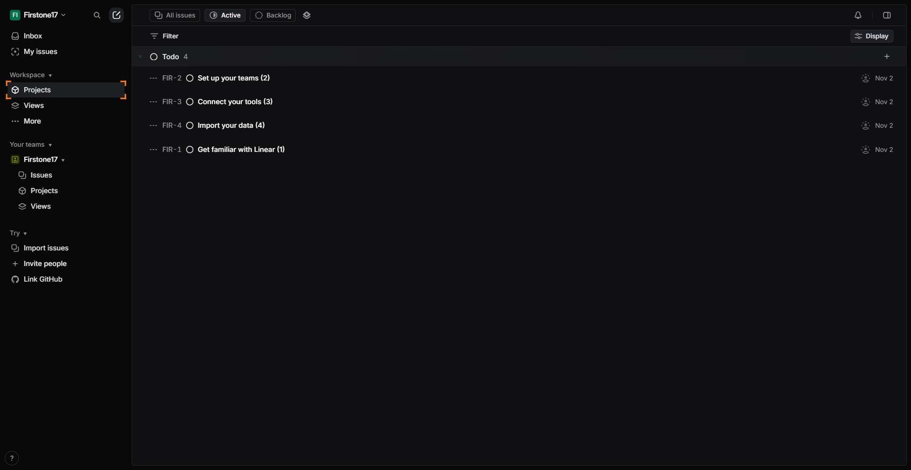
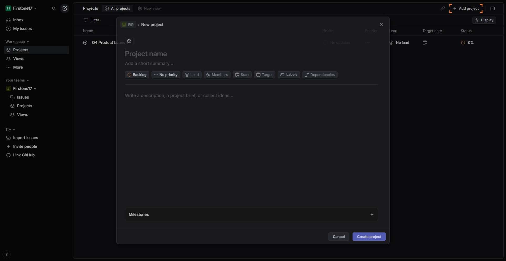
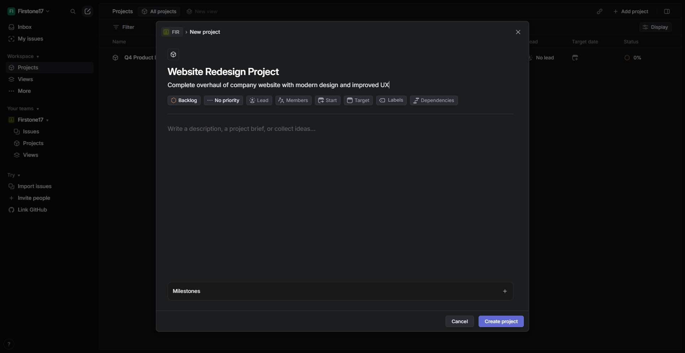
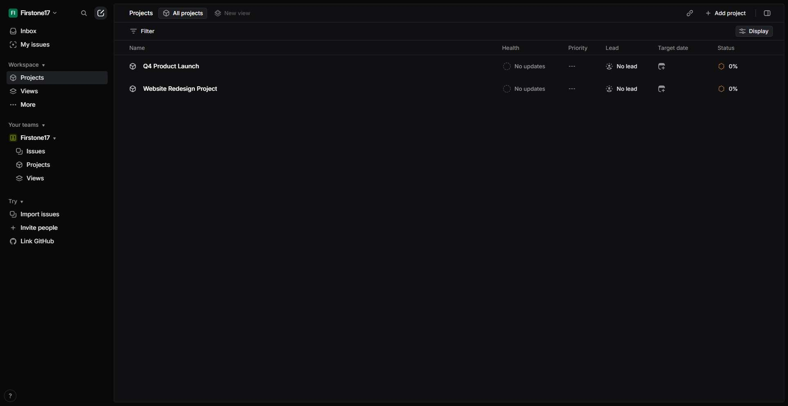

# Workflow Guide

> Auto-generated using Gemini Flash 2.0 AI Analysis
>
> **Task**: Create a project on Linear
>
> **Captured**: 2025-11-02T16:51:46.493981

---

# Workflow Guide: Creating a Project on Linear

This guide details the step-by-step process for a new user or agent to create a new project within the Linear application, starting from the initial navigation.

---

## Essential Context & Initial Setup

This workflow assumes you are starting from a clean state where you need to navigate to the Linear application. **The captured workflow indicates that the agent was already authenticated in a workspace (`Firstone17`) after the initial navigation attempt stabilized.**

*   **Application:** Linear
*   **Initial URL:** \`https://linear.app\`

---

## Complete Workflow Path

The process involves navigating to the platform, finding the existing workspace, accessing the Projects section, initiating project creation, filling out the required details, and finalizing the creation.

### Step 1: Initial Navigation to Linear

The first step is to navigate to the Linear application homepage.

*   **Step 1 Action:** Navigate to Linear at \`https://linear.app\`
*   **URL:** \`https://linear.app\`
*   **What's Happening:** This initial navigation attempt timed out, suggesting the Single Page Application (SPA) took time to load. A subsequent wait was required for the interface to appear.
*   **Screenshot Reference:** 

### Step 2: Wait for Application Load

Following the initial timeout, a deliberate wait was executed to allow the fully interactive Linear SPA to load.

*   **Step 2 Action:** Wait 5 seconds for the page to fully initialize.
*   **URL:** \`https://linear.app/\`
*   **What's Happening:** The screenshot confirms the application has successfully loaded, and the agent is now inside the "Firstone17" workspace, viewing the active issues list (Team FIR). Authentication is complete.
*   **Screenshot Reference:** 

### Step 3: Navigate to the Projects View

From the active issues list, the agent must navigate to the dedicated area for managing projects.

*   **Step 3 Action:** Click on the **"Projects"** link in the left-hand sidebar navigation.
*   **URL:** \`https://linear.app/firstone17/team/FIR/active\` (URL before navigating to projects)
*   **What's Happening:** The screenshot shows the main Linear interface. The target is the "Projects" link located in the sidebar menu, below the team view options. This click successfully navigates the user to the projects overview page.
*   **Screenshot Reference:** 

### Step 4: Initiate Project Creation

Once on the Projects overview page, the button to add a new project is selected.

*   **Step 4 Action:** Click the **"Add project"** button.
*   **URL:** \`https://linear.app/firstone17/projects/all\`
*   **What's Happening:** This screenshot displays the Projects list, showing one existing project ("Q4 Product Launch"). The target button, **"Add project"**, is located in the top-right header area of the main content pane. Clicking this opens the project creation modal.
*   **Screenshot Reference:** 
    *(Note: This step maps to step 5 in the execution log due to system logging structure.)*

### Step 5: Input Project Details (Name and Summary)

The project creation modal appears, requiring input for key identifying information.

*   **Step 5 Action:** Input the desired **Project Name** and **Summary** into the corresponding text fields.
    *   **Project Name:** `Website Redesign Project`
    *   **Summary:** `Complete overhaul of company website with modern design and improved UX`
*   **URL:** \`https://linear.app/firstone17/projects/all\`
*   **What's Happening:** The screenshot shows the modal overlay titled "New project." We have filled the first two mandatory fields (Name and Summary). Other fields (Status, Priority, Lead, Members) retain their default settings.
*   **Screenshot Reference:** 
    *(Note: This step maps to step 6 in the execution log.)*

### Step 6: Finalize and Create Project

With the details entered, the final action is to submit the form.

*   **Step 6 Action:** Click the **"Create project"** button at the bottom of the modal.
*   **URL:** \`https://linear.app/firstone17/projects/all\`
*   **What's Happening:** The screenshot captures the state immediately before clicking "Create project" (index 3896). This action submits the form, closes the modal, and adds the new project to the list.
*   **Screenshot Reference:** 
    *(Note: This step maps to step 7 in the execution log.)*

### Step 7: Verification (Task Completion)

The task is complete once the new project appears in the projects list.

*   **Step 7 Action:** Task Completed.
*   **URL:** \`https://linear.app/firstone17/projects/all\`
*   **What's Happening:** The system confirms the project "Website Redesign Project" is now visible on the main projects page, validating the successful creation.
*   **Screenshot Reference:** 
    *(Note: This step maps to step 9 in the execution log, which is the final `done` state.)*

---

## Workflow Summary

| Step | Action Taken | UI Location / Element | Success Confirmation |
| :--- | :--- | :--- | :--- |
| 1-2 | Navigate to Linear & Wait | \`https://linear.app\` | Interface loaded & authenticated. |
| 3 | Go to Projects View | Sidebar "Projects" link | Navigated to `/projects/all` URL. |
| 4 | Initiate Creation | Top-right "Add project" button | Project creation modal appeared. |
| 5 | Input Project Details | Modal fields (Name, Summary) | Name & Summary text entered. |
| 6 | Finalize Creation | Modal "Create project" button | Form submitted, modal closed. |
| 7 | Verification | Projects List View | **"Website Redesign Project" is visible.** |

---

## Technical Details

- **Architecture**: Browser-Use autonomous agent v0.9.5
- **AI Models**: Claude Sonnet 4.5 (execution) + Gemini Flash 2.0 (guide generation)
- **Metadata**: See `metadata.json` for technical details
- **Workflow Version**: 1.0

Generated by [Flow Planner](https://github.com/your-repo/flow-planner)
