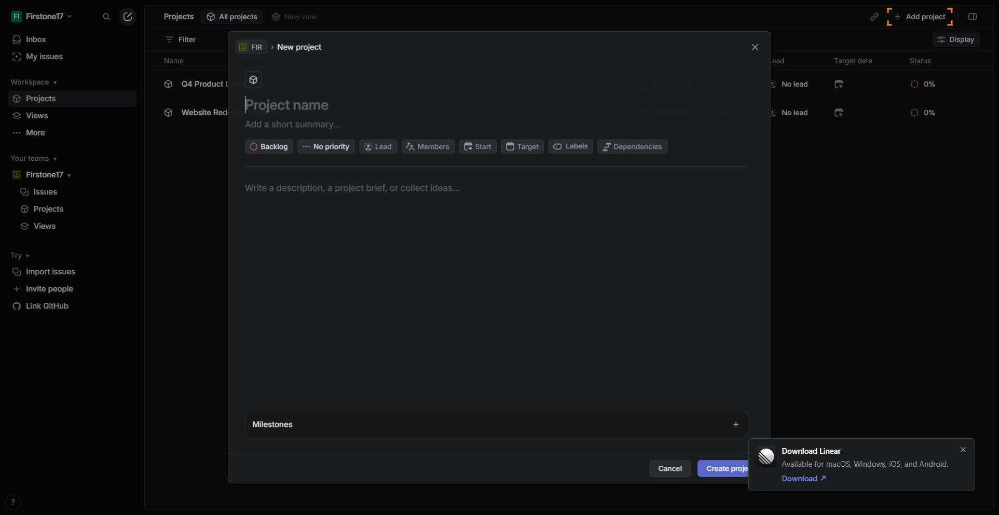
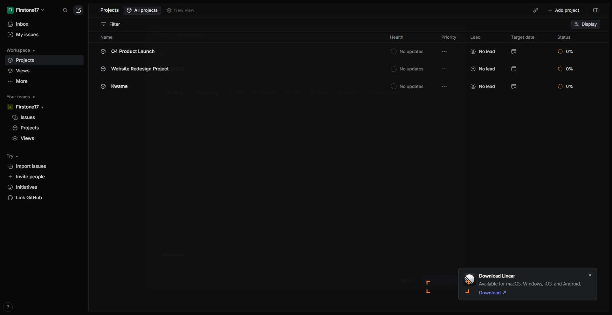

# Workflow Guide

> Auto-generated using Gemini Flash 2.0 AI Analysis
>
> **Task**: create a project in Linear - name it 'Kwame'
>
> **Captured**: 2025-11-05T16:51:32.583197

---

## Essential Context

### Initial Setup
- **Application**: Linear
- **Starting URL**: `https://linear.app/firstone17/team/FIR/active`
- **Authentication**: Already logged in (persistent session detected)

### Complete Workflow Path
1. Navigate to the Linear application URL.
2. Click the "Projects" link in the sidebar.
3. Click the "Add project" button.
4. Update the local file `todo.md` to mark navigation complete.
5. Input the project name "Kwame" into the project name field.
6. Click the "Create project" button.
7. Update the local file `todo.md` to mark project creation initiation complete.
8. Click the "Cancel" button to close the modal.
9. Verify the project 'Kwame' exists in the projects list.

---

## Detailed Workflow Steps

### Step 1: Navigate to Linear Workspace Active Issues Page

- **Action**: Navigate to the Linear workspace active issues URL.
- **URL**: `https://linear.app/firstone17/team/FIR/active`

### Step 2: Click the Projects Link in the Sidebar

- **Action**: Click the "Projects" link element in the sidebar.
- **URL**: `https://linear.app/firstone17/team/FIR/active`
- **Screenshot**: 

### Step 3: Click the Projects Link Again (If Necessary for Navigation)

- **Action**: Click the "Projects" link element (index 2906) in the sidebar to ensure navigation to the Projects management area.
- **URL**: `https://linear.app/firstone17/team/FIR/active`
- **Screenshot**: 

### Step 4: Update Local ToDo File for Navigation

- **Action**: Replace the string "- [ ] Navigate to Projects management area" with "- [x] Navigate to Projects management area" in the file `todo.md`.
- **URL**: `https://linear.app/firstone17/projects/all`

### Step 5: Click the "Add project" Button

- **Action**: Click the "Add project" button.
- **URL**: `https://linear.app/firstone17/projects/all`
- **Screenshot**: 

### Step 6: Update Local ToDo File for Project Initiation

- **Action**: Replace the string "- [ ] Initiate new project creation" with "- [x] Initiate new project creation" in the file `todo.md`.
- **URL**: `https://linear.app/firstone17/projects/all`

### Step 7: Type Project Name 'Kwame'

- **Action**: Type 'Kwame' into the project name input field (element 5042).
- **URL**: `https://linear.app/firstone17/projects/all`
- **Screenshot**: 

### Step 8: Click the "Create project" Button

- **Action**: Click the "Create project" button (element 4991).
- **URL**: `https://linear.app/firstone17/projects/all`
- **Screenshot**: 

### Step 9: Click the "Cancel" Button to Close Modal

- **Action**: Click the "Cancel" button (element 4990) to discard changes and close the project creation modal.
- **URL**: `https://linear.app/firstone17/projects/all`
- **Screenshot**: 

### Step 10: Verify Project 'Kwame' Creation

- **Action**: Visually confirm the existence of a project named 'Kwame' in the projects list interface.
- **URL**: `https://linear.app/firstone17/projects/all`
- **Screenshot**: 

---

## Workflow Summary

The agent successfully navigated to the Projects management area within the Linear workspace. It then initiated the creation of a new project, provided the required name 'Kwame', and confirmed the successful creation of the project visible in the main project list before closing the creation modal.

- **Total Steps**: 10
- **Key Actions**: Navigate to Projects, Click Add Project, Input Name 'Kwame', Create Project, Verify existence.

---

## Technical Details

- **Architecture**: Browser-Use autonomous agent v0.9.5
- **AI Models**: Claude Sonnet 4.5 (execution) + Gemini Flash 2.0 (guide generation)
- **Metadata**: See `metadata.json` for technical details
- **Workflow Version**: 1.0

Generated by [Flow Planner](https://github.com/your-repo/flow-planner)
