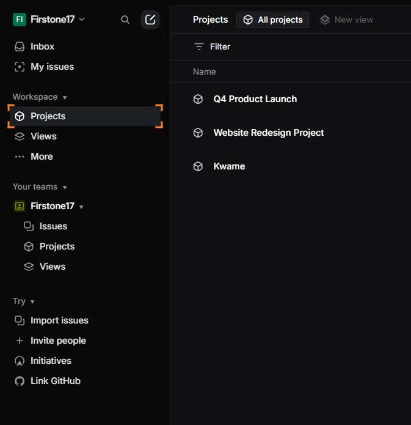
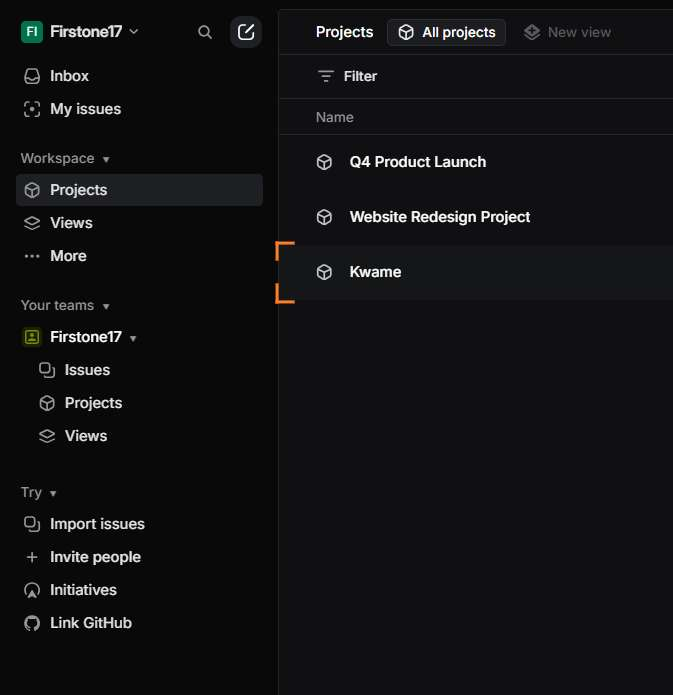
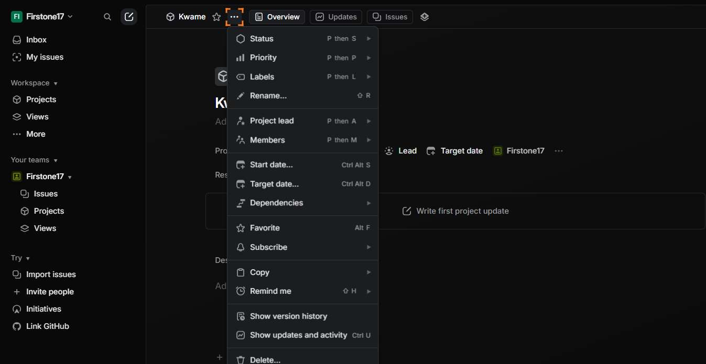

# Workflow Guide

> Auto-generated using Gemini Flash 2.0 AI Analysis
>
> **Task**: delete a project on Linear, with name: Kwame
>
> **Captured**: 2025-11-05T17:30:20.102703

---

## Essential Context

### Initial Setup
- **Application**: Linear
- **Starting URL**: `https://linear.app`
- **Authentication**: Already logged in (persistent session detected)

### Complete Workflow Path
1. Navigate to the Linear application URL.
2. Click the workspace-level "Projects" link in the sidebar.
3. Click the "Kwame" project link from the projects list.
4. Wait for the Kwame project detail page to load completely.
5. Click the "Project actions" button on the Kwame project page.
6. Click the "Delete project" option from the actions menu.
7. Confirm the project deletion in the modal dialog.
8. Wait for the deletion confirmation toast notification to appear.
9. Click the workspace-level "Projects" link in the sidebar to navigate to the Projects management area for verification.
10. Verify that the "Kwame" project is no longer listed in the Projects management area.

---

## Detailed Workflow Steps

### Step 1: Navigate to Linear application

- **Action**: Navigate to the Linear application URL
- **URL**: `https://linear.app`

### Step 2: Click the workspace-level Projects link

- **Action**: Click the Projects link with index 2629 to navigate to the Projects management area
- **URL**: `https://linear.app/firstone17/team/FIR/active`
- **Screenshot**: 

### Step 3: Click the Kwame project link

- **Action**: Click the Kwame project link with index 3706 to navigate to its detail page
- **URL**: `https://linear.app/firstone17/projects/all`
- **Screenshot**: 

### Step 4: Wait for project details to load

- **Action**: Wait for 3 seconds to ensure the Kwame project detail page has fully loaded
- **URL**: `https://linear.app/firstone17/project/kwame-3b9925f914f2/overview`

### Step 5: Click the Project actions button

- **Action**: Click the button labeled "Project actions" with index 6410 to open the actions menu
- **URL**: `https://linear.app/firstone17/project/kwame-3b9925f914f2/overview`
- **Screenshot**: 

### Step 6: Click the Delete project option

- **Action**: Click the "Delete project" option within the opened actions menu
- **URL**: `https://linear.app/firstone17/project/kwame-3b9925f914f2/overview`

### Step 7: Confirm project deletion

- **Action**: Click the "Delete" button within the confirmation modal dialog
- **URL**: `https://linear.app/firstone17/project/kwame-3b9925f914f2/overview`

### Step 8: Wait for deletion confirmation

- **Action**: Wait for 2 seconds to allow the deletion confirmation toast notification to appear
- **URL**: `https://linear.app/firstone17/project/kwame-3b9925f914f2/overview`

### Step 9: Navigate to Projects management area for verification

- **Action**: Click the workspace-level Projects link with index 6199 to navigate to the Projects management area
- **URL**: `https://linear.app/firstone17/team/FIR/active`
- **Screenshot**: 

### Step 10: Verify project deletion

- **Action**: Verify that the project named "Kwame" is no longer visible in the list of projects
- **URL**: `https://linear.app/firstone17/projects/all`

---

## Workflow Summary

The agent successfully navigated to the Linear application, located the project named 'Kwame' in the Projects management area, accessed its action menu, executed the 'Delete project' action, confirmed the deletion, and navigated back to the Projects list to verify that 'Kwame' is permanently removed from the workspace.

- **Total Steps**: 10
- **Key Actions**: Navigate to Projects, Click Kwame Project, Click Project Actions, Delete Project, Confirm Deletion, Verify Removal from Projects List.

---

## Technical Details

- **Architecture**: Browser-Use autonomous agent v0.9.5
- **AI Models**: Claude Sonnet 4.5 (execution) + Gemini Flash 2.0 (guide generation)
- **Metadata**: See `metadata.json` for technical details
- **Workflow Version**: 1.0

Generated by [Flow Planner](https://github.com/your-repo/flow-planner)

---

## Refinement Information

This guide has been enhanced using Vision AI to validate and crop screenshots for clarity.

- **Refined Screenshots**: 8/8
- **Refinement Date**: 2025-11-05 17:31:34
- **Models Used**: gemini

### Refinement Details

| Step | Original | Refined | Valid | Grid Location |
|------|----------|---------|-------|---------------|
| 3 | step_003.png | step_003_refined.png | Yes | [(1, 1), (2, 1)] |
| 4 | step_004.png | step_004_refined.png | Yes | [(1, 1), (2, 1)] |
| 6 | step_006.png | step_005_refined.png | Yes | [(1, 1), (2, 1)] |
| 8 | step_008.png | step_008_refined.png | Yes | [(1, 1), (2, 1), (2, 2)] |
| 9 | step_009.png | step_009_refined.png | Yes | [(1, 2), (2, 2)] |
| 10 | step_010.png | step_010_refined.png | Yes | [(2, 3), (3, 3)] |
| 11 | step_011.png | step_011_refined.png | Yes | [(1, 1), (2, 1)] |
| 12 | step_012.png | step_011_refined.png | Yes | [(1, 1), (2, 1)] |
