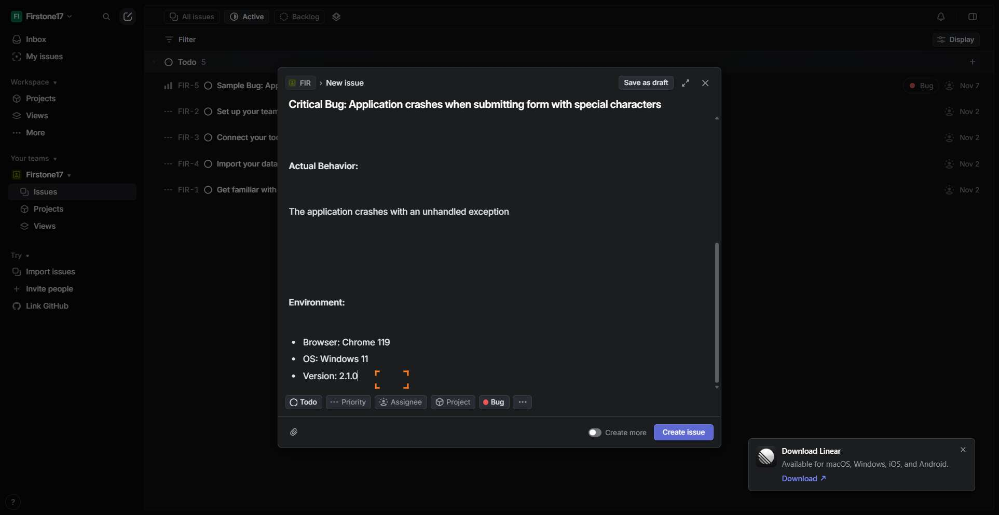
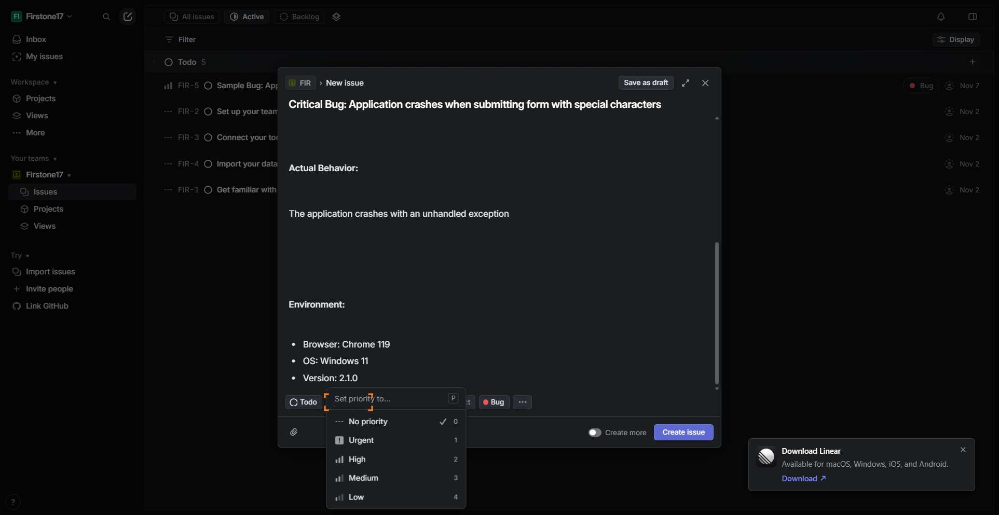
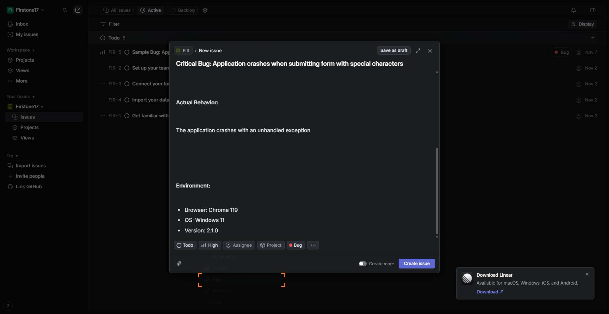

# Workflow Guide

> Auto-generated using Gemini Flash 2.0 AI Analysis
>
> **Task**: How can you add a bug report for a project in Linear?
>
> **Captured**: 2025-11-07T13:57:57.187764

---

## Essential Context

### Initial Setup
- **Application**: Linear
- **Starting URL**: `https://linear.app`
- **Authentication**: Already logged in (persistent session detected)

### Complete Workflow Path
1. Navigate to the Linear application URL.
2. Navigate to the specified workspace and team view.
3. Click the button to initiate the new issue creation modal.
4. Type the issue title into the title input field.
5. Type the detailed description into the description textarea.
6. Click the suggested "Bug" label button.
7. Click the "Priority" selection field.
8. Select the "High" priority option from the displayed dropdown list.
9. Click the "Create issue" button to finalize the report.
10. Verify the new issue is successfully created and visible in the list.

---

## Detailed Workflow Steps

### Step 1: Navigate to the Linear Application

- **Action**: Navigate to the Linear application URL.
- **URL**: `https://linear.app/firstone17/team/FIR/active`

### Step 2: Navigate to Workspace View

- **Action**: Verify the active workspace and team view loads successfully.
- **URL**: `https://linear.app/firstone17/team/FIR/active`

### Step 3: Initiate New Issue Creation

- **Action**: Click the button labeled "Create new issue" or similar control to open the issue creation form.
- **URL**: `https://linear.app/firstone17/team/FIR/active`

### Step 4: Input Issue Title

- **Action**: Type "Critical Bug: Application crashes when submitting form with special characters" into the issue title field.
- **URL**: `https://linear.app/firstone17/team/FIR/active`

### Step 5: Input Issue Description

- **Action**: Type the comprehensive bug report content into the issue description field.
- **URL**: `https://linear.app/firstone17/team/FIR/active`

### Step 6: Apply the Bug Label

- **Action**: Click the button role=button "Bug" aria-label=Apply suggested "Bug".
- **URL**: `https://linear.app/firstone17/team/FIR/active`
- **Screenshot**: 

### Step 7: Open Priority Selection

- **Action**: Click the combobox element currently displaying "No priority".
- **URL**: `https://linear.app/firstone17/team/FIR/active`
- **Screenshot**: 

### Step 8: Set Priority to High

- **Action**: Click the list item with text "High\n2".
- **URL**: `https://linear.app/firstone17/team/FIR/active`
- **Screenshot**: 

### Step 9: Create the Issue

- **Action**: Click the primary "Create issue" button to submit the form.
- **URL**: `https://linear.app/firstone17/team/FIR/active`

### Step 10: Verify Issue Creation Success

- **Action**: Observe the UI to confirm the issue creation modal closes and the new issue appears in the active issue list with the correct title and Bug label applied.
- **URL**: `https://linear.app/firstone17/team/FIR/active`

---

## Workflow Summary

The agent successfully navigated to the Linear workspace, initiated issue creation, and populated all required fields for a bug report, including title, description, the 'Bug' type label, and 'High' priority. The final step involved submitting the form to successfully register the bug report within the project team view.

- **Total Steps**: 10
- **Key Actions**: Navigate to URL, Type title, Type description, Click 'Bug' label suggestion, Click 'Priority' field, Select 'High' priority, Click 'Create issue'.

---

## Technical Details

- **Architecture**: Browser-Use autonomous agent v0.9.5
- **AI Models**: Claude Sonnet 4.5 (execution) + Gemini Flash 2.0 (guide generation)
- **Metadata**: See `metadata.json` for technical details
- **Workflow Version**: 1.0

Generated by [Flow Planner](https://github.com/your-repo/flow-planner)
