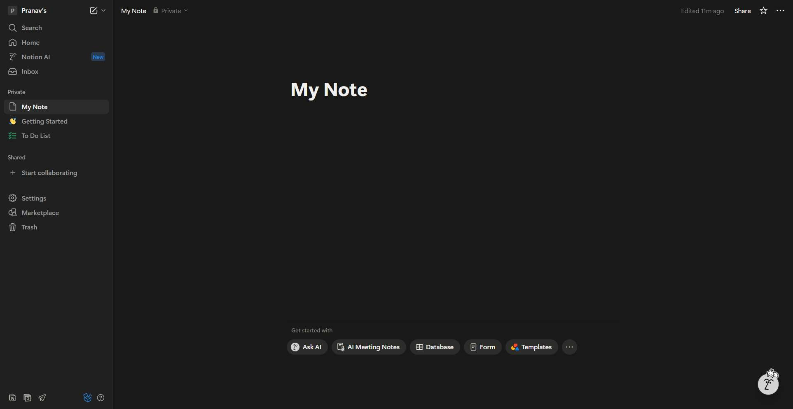
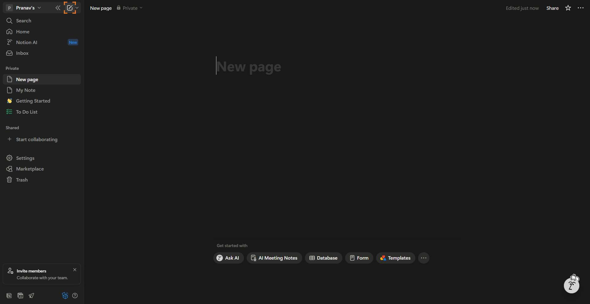
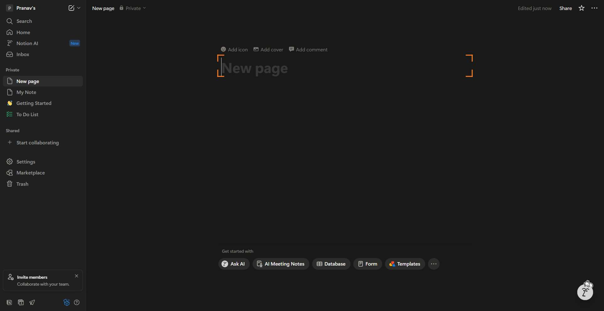
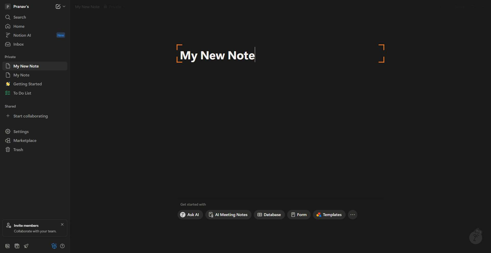
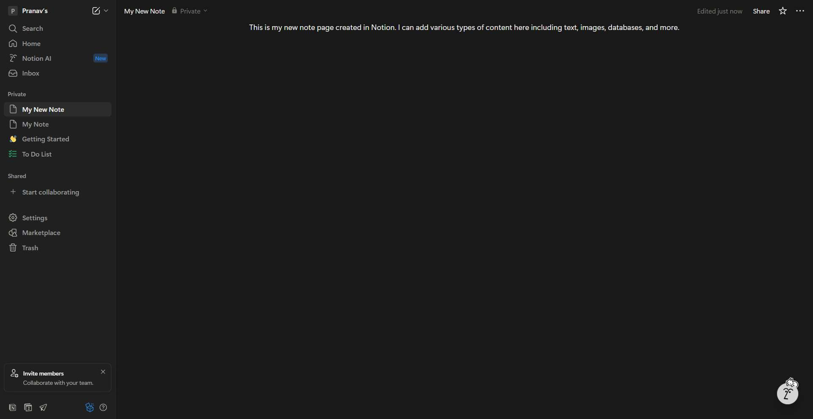

# Workflow Guide

> Auto-generated using Gemini Flash 2.0 AI Analysis
>
> **Task**: Create a note page on Notion
>
> **Captured**: 2025-11-02T16:49:03.727932

---

# Notion Workflow Guide: Creating a New Note Page

This guide details the steps successfully executed to create a new, populated note page within the Notion workspace.

**Original Task**: Create a note page on Notion
**Total Steps**: 7
**Outcome**: Success

---

## Workflow Steps

### Step 1: Navigate to Notion Homepage

The process began by navigating directly to the Notion homepage to access the authenticated workspace.

*   **Action**: Navigate to `https://www.notion.so`
*   **URL**: `https://www.notion.so`
*   **Notes**: The agent was already logged into a Notion workspace ("Pranav's"), so the dashboard loaded immediately.
*   **Screenshot**: 

### Step 2: Initiate New Page Creation

With the workspace loaded, the agent located and clicked the designated button to create a new page.

*   **Action**: Click the 'New page' button (identified by `role=button aria-label=New page`).
*   **URL**: `https://www.notion.so/My-Note-29fa73f5b00480d29191ca7b2e923d6a`
*   **Notes**: This action successfully opened a blank, untitled new page ready for configuration.
*   **Screenshot**: 

### Step 3: Focus on the Page Title Field

To begin editing the page, the agent focused on the primary title element of the newly created page.

*   **Action**: Click on the main title placeholder (`h1` element).
*   **URL**: `https://www.notion.so/29fa73f5b00480d29191ca7b2e923d6a?showMoveTo=true&saveParent=true`
*   **Notes**: Clicking the title field activated the page editor, causing new interactive elements (like 'Add icon', 'Add cover') to appear.
*   **Screenshot**: 

### Step 4: Input the Page Title

The agent entered the desired title for the new note page.

*   **Action**: Input text into the title field (index 771).
    *   **Text Entered**: "My New Note"
*   **URL**: `https://www.notion.so/29fa73f5b00480d29191ca7b2e923d6a?showMoveTo=true&saveParent=true`
*   **Notes**: Upon input, the title "My New Note" immediately updated in the page header and in the sidebar navigation.
*   **Screenshot**: 

### Step 5: Input Page Content

The agent then focused on the main body of the page and added descriptive content.

*   **Action 1**: Click the content textbox (index 755).
*   **Action 2**: Input sample text into the content textbox (index 755).
    *   **Text Entered**: "This is my new note page created in Notion. I can add various types of content here including text, images, databases, and more."
*   **URL**: `https://www.notion.so/My-New-Note-29fa73f5b00480d29191ca7b2e923d6a?showMoveTo=true&saveParent=true`
*   **Notes**: The input was successful, and Notion's auto-save feature immediately recorded the content.
*   **Screenshot**: 

### Step 6: Final Verification (Implicit)

This step involved confirming that the content was added correctly, which was achieved concurrently with the content input action in Step 5, as Notion auto-saves immediately.

*   **Action**: Implicitly verified content is visible and the page status shows "Edited just now".
*   **URL**: `https://www.notion.so/My-New-Note-29fa73f5b00480d29191ca7b2e923d6a?showMoveTo=true&saveParent=true`
*   **Notes**: The page is fully rendered with both title and body content saved.
*   **Screenshot**: 

### Step 7: Task Completion and Reporting

The final step confirmed that the page creation, naming, and content population were successful, and the page was accessible in the sidebar.

*   **Action**: Executed `done` command, reporting successful completion.
*   **URL**: `https://www.notion.so/My-New-Note-29fa73f5b00480d29191ca7b2e923d6a?showMoveTo=true&saveParent=true`
*   **Notes**: The workflow concluded with the final page visible and saved in the workspace.
*   **Screenshot**: 

---

## Summary of Results

The goal to create a note page on Notion was fully achieved. The resulting page is:

*   **Title**: My New Note
*   **Content**: "This is my new note page created in Notion. I can add various types of content here including text, images, databases, and more."
*   **Status**: Auto-saved and permanently accessible in the sidebar under the "Private" section of the workspace.

---

## Technical Details

- **Architecture**: Browser-Use autonomous agent v0.9.5
- **AI Models**: Claude Sonnet 4.5 (execution) + Gemini Flash 2.0 (guide generation)
- **Metadata**: See `metadata.json` for technical details
- **Workflow Version**: 1.0

Generated by [Flow Planner](https://github.com/your-repo/flow-planner)
