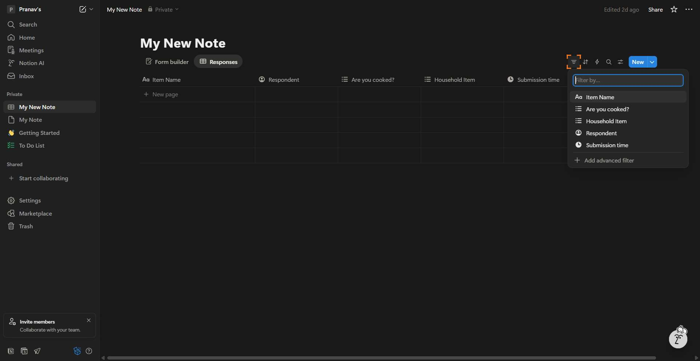
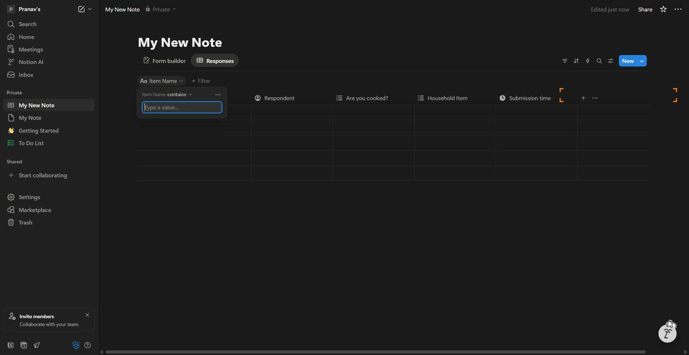

# Workflow Guide

> Auto-generated using Gemini Flash 2.0 AI Analysis
>
> **Task**: How do I filter a database in Notion?
>
> **Captured**: 2025-11-05T23:30:26.808867

---

## Essential Context

### Initial Setup
- **Application**: Notion
- **Starting URL**: `https://www.notion.so/29fa73f5b00480d29191ca7b2e923d6a?v=2a1a73f5b00480ec8b72000cd726b707`
- **Authentication**: Already logged in (persistent session detected)

### Complete Workflow Path
1. Navigate to the specified Notion database view URL.
2. Click the Filter button associated with the database view.
3. Click the property name "Item Name" from the filter options list.
4. Type the filter value "cat" into the designated text input field.

---

## Detailed Workflow Steps

### Step 1: Navigate to the Notion Database View

- **Action**: Navigate to the provided URL to load the Notion page containing the database view.
- **URL**: `https://www.notion.so/29fa73f5b00480d29191ca7b2e923d6a?v=2a1a73f5b00480ec8b72000cd726b707`

### Step 2: Click the Filter Button

- **Action**: Click the button labeled "Filter" located above the database view.
- **URL**: `https://www.notion.so/29fa73f5b00480d29191ca7b2e923d6a?v=2a1a73f5b00480ec8b72000cd726b707`
- **Screenshot**: 

### Step 3: Select the Filter Property

- **Action**: Click the filter option corresponding to the property "Item Name" in the opened filter interface.
- **URL**: `https://www.notion.so/29fa73f5b00480d29191ca7b2e923d6a?v=2a1a73f5b00480ec8b72000cd726b707`
- **Screenshot**: 

### Step 4: Input the Filter Value

- **Action**: Type the text "cat" into the filter value input field, clearing any existing content.
- **URL**: `https://www.notion.so/29fa73f5b00480d29191ca7b2e923d6a?v=2a1a73f5b00480ec8b72000cd726b707`
- **Screenshot**: 

---

## Workflow Summary

This guide details how to filter a database in Notion. The agent navigated to the database view, clicked the Filter control, selected the "Item Name" property, and input the value "cat" into the appropriate text field. Upon entering the value, Notion automatically applies the filter, demonstrating the successful filtering process.

- **Total Steps**: 4
- **Key Actions**: Navigate to view, Click Filter, Select Property, Type Filter Value

---

## Technical Details

- **Architecture**: Browser-Use autonomous agent v0.9.5
- **AI Models**: Claude Sonnet 4.5 (execution) + Gemini Flash 2.0 (guide generation)
- **Metadata**: See `metadata.json` for technical details
- **Workflow Version**: 1.0

Generated by [Flow Planner](https://github.com/your-repo/flow-planner)
