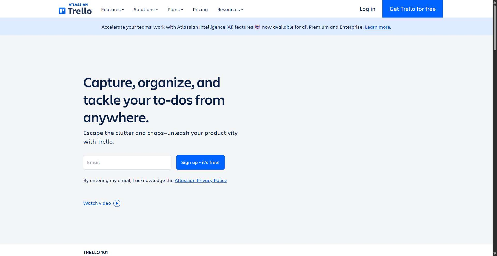
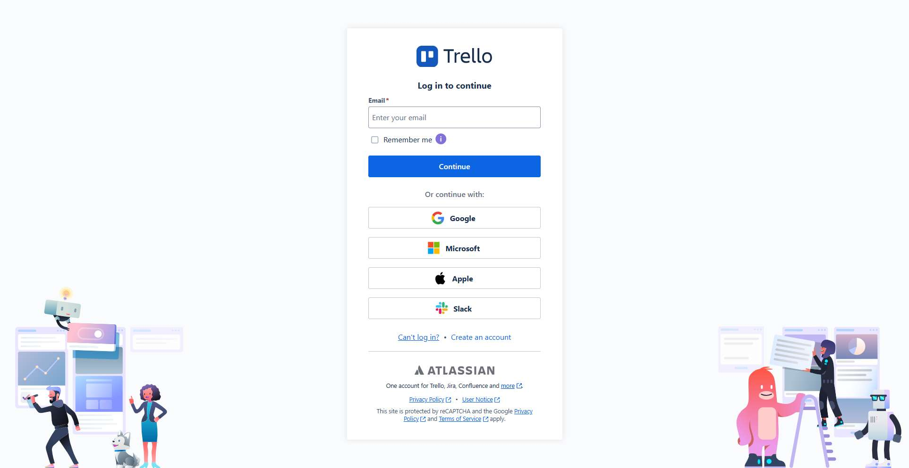
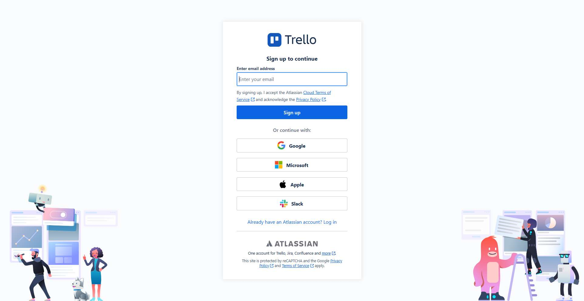
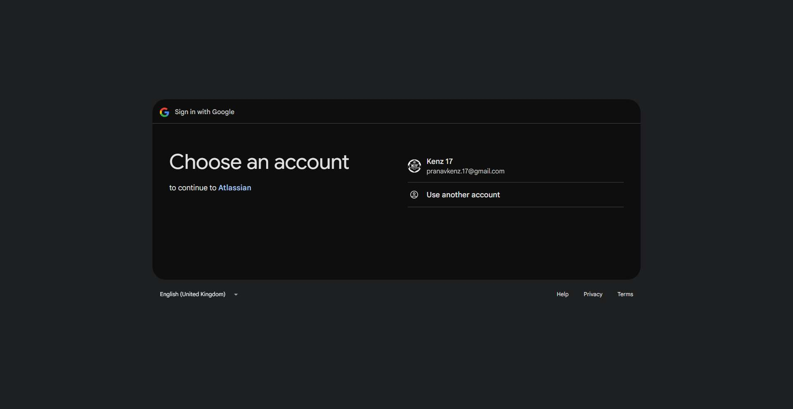
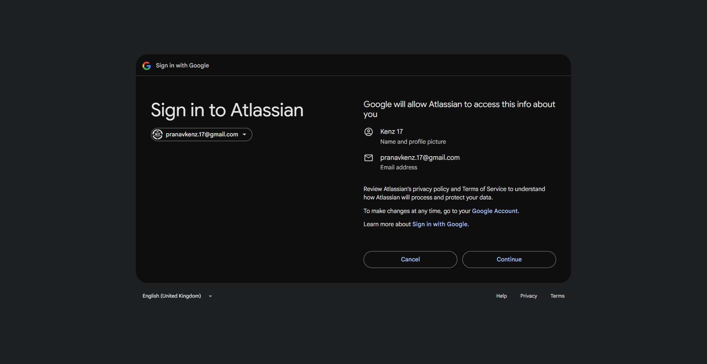
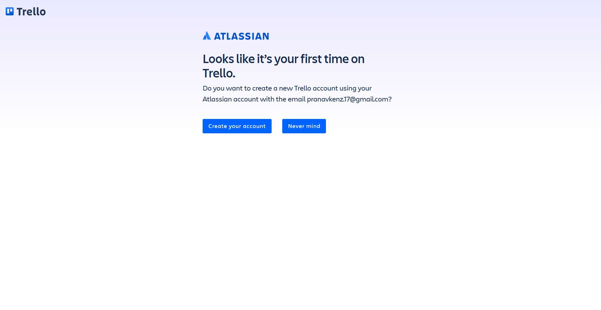
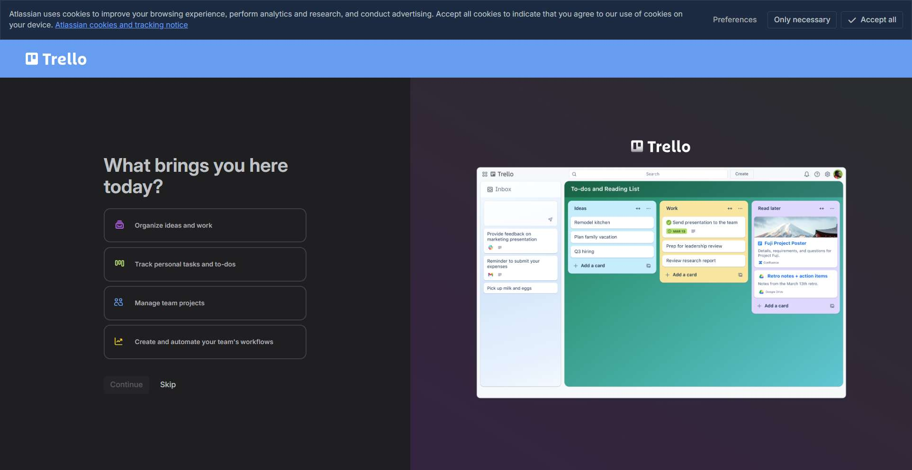
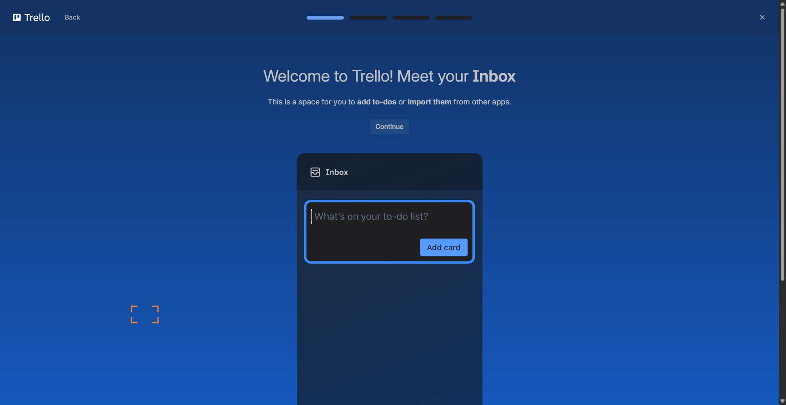
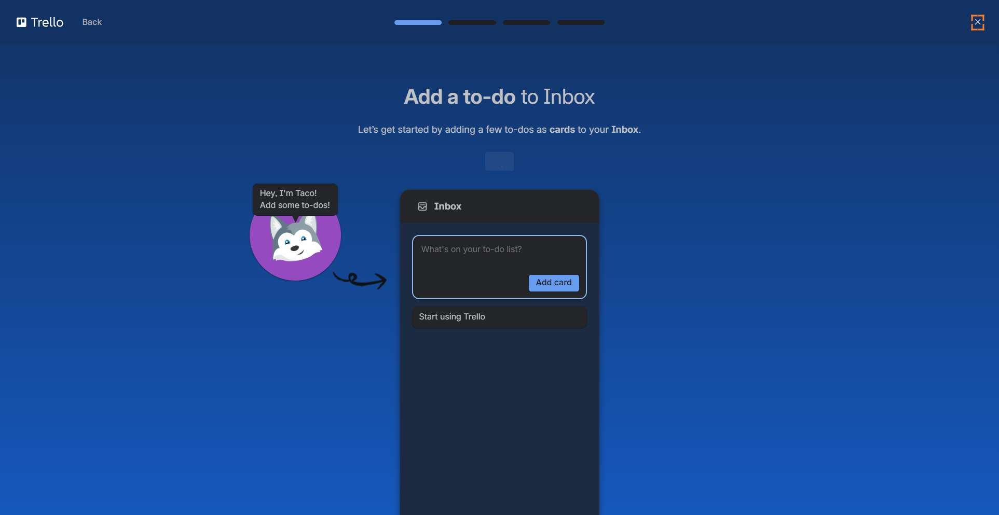
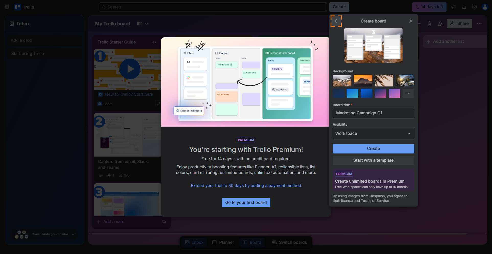

# Workflow Guide

> Auto-generated using Gemini Flash 2.0 AI Analysis
>
> **Task**: Go to Trello.com, create a new board called 'Marketing Campaign Q1'
>
> **Captured**: 2025-11-05T23:41:27.912272

---

## Essential Context

### Initial Setup
- **Application**: Trello.com
- **Starting URL**: `https://trello.com/`
- **Authentication**: Manual login required via Google SSO was executed to gain access.

### Complete Workflow Path
1. Navigate to Trello.com.
2. Click the "Log in" button.
3. Click the "Create an account" link.
4. Click the "Google" SSO button.
5. Select the existing Google account for sign-in.
6. Click "Continue" on the OAuth consent screen.
7. Click the "Create your account" button to finalize account creation.
8. Accept all cookies.
9. Skip the initial onboarding screen.
10. Close the subsequent Inbox tutorial screen.
11. Exit the final tutorial screen by clicking "Start using Trello".
12. Click the "Create" button in the header to open the board creation menu.
13. Click the "Create board" option.
14. Type the board name "Marketing Campaign Q1" into the title field.
15. Click the "Create" button to finalize the board creation.
16. Verify that the new board "Marketing Campaign Q1" is loaded.

---

## Detailed Workflow Steps

### Step 1: Navigate to Trello.com homepage

- **Action**: Navigate the browser to the Trello homepage.
- **URL**: `https://trello.com/`

### Step 2: Click the "Log in" button

- **Action**: Click the "Log in" button.
- **URL**: `https://trello.com/`
- **Screenshot**: 

### Step 3: Click the "Create an account" link

- **Action**: Click the "Create an account" link to initiate signup.
- **URL**: `https://id.atlassian.com/login?application=trello&continue=https%3A%2F%2Ftrello.com%2Fauth%2Fatlassian%2Fcallback%3Fdisplay%3DeyJ2ZXJpZmljYXRpb25TdHJhdGVneSI6InNvZnQifQ%253D%253D&display=eyJ2ZXJpZmljYXRpb25TdHJhdGVneSI6InNvZnQifQ%3D%3D`
- **Screenshot**: 

### Step 4: Click the Google SSO button

- **Action**: Click the "Google" SSO button.
- **URL**: `https://id.atlassian.com/signup?application=trello&continue=https%3A%2F%2Ftrello.com%2Fauth%2Fatlassian%2Fcallback%3Fdisplay%3DeyJ2ZXJpZmljYXRpb25TdHJhdGVneSI6InNvZnQifQ%253D%253D&display=eyJ2ZXJpZmljYXRpb25TdHJhdGVneSI6InNvZnQifQ%3D%3D`
- **Screenshot**: 

### Step 5: Select the existing Google account

- **Action**: Click on the available Google account listing for "Kenz 17".
- **URL**: `https://accounts.google.com/v3/signin/accountchooser?client_id=596149463257-9oquqfivs9on8t8erq23c8qso6vk3cp1.apps.googleusercontent.com&code_challenge=946USev7_b4vLIwWyJn14-P8nj6kNmhbxMHJX1pK24Q&code_challenge_method=S256&prompt=select_account&redirect_uri=https%3A%2F%2Fid.atlassian.com%2Flogin%2Fgoogle&response_type=code&scope=openid+email+profile&state=eyJjc3JmVG9rZW4iOiI4MmQ3NzM0ODY2YWQ3NzMyZjY4ODQzZmJlNjdhMDIxOTVlZWY1ODA1MzU5NjJlMzU2MzY5ZWUzZDcyYzg4M2I1IiwiYW5vbnltb3VzSWQiOiIwYWQ4NWZiMi1jZTdmLTQ3MDAtOWM0My05NmZkYmI1MmIwODIiLCJxdWVyeSI6Ij9hcHBsaWNhdGlvbj10cmVsbG8mY29udGludWU9aHR0cHMlM0ElMkYlMkZ0cmVsbG8uY29tJTJGYXV0aCUyRmF0bGFzc2lhbiUyRmNhbGxiYWNrJTNGZGlzcGxheSUzRGV5SjJaWEpwWm1sallYUnBiMjVUZEhKaGRHVm5lU0k2SW5OdlpuUWlmUSUyNTNEJTI1M0QmZGlzcGxheT1leUoyWlhKcFptbGpZWFJwYjI1VGRISmhkR1ZuZVNJNkluTnZablFpZlElM0QlM0QmbG9naW5UeXBlPWdvb2dsZUJ1dHRvbiZwcm9tcHQ9c2VsZWN0X2FjY291bnQmc291cmNlPWF0bGFzc2lhbkFjY291bnRTaWdudXBTY3JlZW4iLCJzb3VyY2UiOiJhdGxhc3NpYW5BY2NvdW50U2lnbnVwU2NyZWVuIiwibG9naW5UeXBlIjoiZ29vZ2xlQnV0dG9uIn0%3D&dsh=S-786152372%3A1762403662221251&o2v=2&service=lso&flowName=GeneralOAuthFlow&opparams=%253F&continue=https%3A%2F%2Faccounts.google.com%2Fsignin%2Foauth%2Fconsent%3Fauthuser%3Dunknown%26part%3DAJi8hAOdttj28Ww8h6p9pOEKMA_qEkbx_uQA3FXJih7Q7BxVFiu2S9XlK-xRFWM9RSBzewZn4x56qr-2Xr0Yr-bnvtzrh7SYiXgDYnP-EDbYqcSfwiP-Nb7LKuavcTs80tKy5y2iW-nGMkeAZ_-q-Nnirca11XCJx2a5qP1P2CVnjk8p5UjR33kvkNyZo15KlEfiCMVIt9HC__G4tu3D3sSqIZJS19_TGQVsJ6KhxX3Gn44l0uHgBOHFoNCAp9pDolqBUH6fMg-J0-A9nkknnV1GiGF_vEb0As1EzZF1X5hF8q25nZG-3rWwMJU7E4pl8DAHuLeus4PJKRKxfqVa9HDVsSo8TZOf_uNNCUo7WprOvwQsiQdtEl5bghfMMGArKHsKL9CuyrUB2uDYs0Th8nlqyeUWetAyDoLoDa5om-2Orqk3Dl9i3kgONQvdMauT-T_GrqYuglkkYo-29dwlwtY2Z0P16ftMWw%26flowName%3DGeneralOAuthFlow%26as%3DS-786152372%253A1762403662221251%26client_id%3D596149463257-9oquqfivs9on8t8erq23c8qso6vk3cp1.apps.googleusercontent.com%23&app_domain=https%3A%2F%2Fid.atlassian.com`
- **Screenshot**: 

### Step 6: Click "Continue" on the OAuth consent screen

- **Action**: Click the "Continue" button on the Google OAuth consent screen to authorize access.
- **URL**: `https://accounts.google.com/signin/oauth/id#?authuser=0&part=AJi8hAP9GNOVSpC2btXghjf39uVTPTjRzcTbegIUw644SjbC4Z4wq5XRfDgH2utaneWGIoUN6I2Hx7spMSAMqA3ZDxP7VC5lEa_eOLV-2x5Yx2LJ1MjkXGFRPD51L0iaB0FhaOCzKcFl2bG5rMC3tVPwnA0CONJCEO0pLu12w4PcPvhorC82ZL-6NMsGc2lmLaCPdQS04P5EyF-NOCoA403iBMUX6naPSiZGR9jfs43gDKAMvDyAbkDmbk3LGWnx_THU3VC2DlUE1PthskEOyJU2jZxbuNhv2q2-ME11O0A5bAesgAkpRb_5i6RooWxD_vQmao4l9gkqOjRjNygBW9ImXWgd4LGR0SyyGutcCDCBiMka5Q6Ykp6DXW2PkMbuBFV-_RLhqm6wqYAXW6GkTBvaHf2QYtQ7-8Vlb4OjJV9KdEm_HU1QLr7y5FZfm_TBS7hNUc6TtxP4fonRP4KsMhkayzCqfnN77psbSMNRDL80YY7cQvOEeLJqFXoMGfbBxmTSCk1YgpLYre92A8MzYDBzGlNLB747s2BANkI1DghErFf0i2-UikKxpvKdTSrR6qnXMDoYKGaJOHOEELUBJaEx-TQ8CiKM4pvQ3RPNlgb6KkAHTe3C_M_X6Zl9VGrG280m4YIb3ImQpuUW2Ero4VujP2sn11_pgC6K5ZYcirYhw2_BzxBQQc5suQlfEWJfBfQZ6kGmdPzT-oLnwDiMDdIQksYLWOs_KxqIRMNGFuG9jR5PMjWVf-ZdqXadK1NS6PQnw_INr2K4I583lYFePJ4YmazGQ0l2AjHXcfQch_SkF3bai5eYBL-1KrMUC_PkSICTfHjt0YXwK8pFUv4G_knxd8-BTZYYjQ&flowName=GeneralOAuthFlow&as=S-786152372%3A1762403662221251&client_id=596149463257-9oquqfivs9on8t8erq23c8qso6vk3cp1.apps.googleusercontent.com&rapt=AEjHL4NBP3YdrWmYEAcEB4pj2P8fHjBrjVU75Xf2VgFSXUBePgrU0X6FIEbZpju8FoSwoywIWhw_PRGS4EBg42OOfAuaaqJ811nlxxLaeSPxi0kMbVMZ-wg`
- **Screenshot**: 

### Step 7: Click the "Create your account" button

- **Action**: Click the "Create your account" button to proceed with Trello account setup.
- **URL**: `https://trello.com/account-creation?returnUrl=%2F&email=pranavkenz.17%40gmail.com`
- **Screenshot**: 

### Step 8: Accept all cookies

- **Action**: Click the "Accept all" button on the cookie consent banner.
- **URL**: `https://trello.com/welcome-to-trello`
- **Screenshot**: 

### Step 9: Skip the initial onboarding screen

- **Action**: Click the "Skip" button to bypass the "What brings you here today?" onboarding prompt.
- **URL**: `https://trello.com/welcome-to-trello`
- **Screenshot**: 

### Step 10: Close the subsequent tutorial screen

- **Action**: Click the "Close" button (aria-label=Close) to dismiss the "Meet your Inbox" tutorial overlay.
- **URL**: `https://trello.com/welcome-to-trello`
- **Screenshot**: 

### Step 11: Exit the final tutorial screen

- **Action**: Click the "Start using Trello" button to exit the onboarding flow completely and access the main dashboard.
- **URL**: `https://trello.com/welcome-to-trello`
- **Screenshot**: 

### Step 12: Click the "Create" button in the header

- **Action**: Click the "Create" button located in the main header navigation bar.
- **URL**: `https://trello.com/b/5ufSZUbM/my-trello-board`
- **Screenshot**: 

### Step 13: Click the "Create board" option

- **Action**: Click the "Create board" button within the opened creation menu.
- **URL**: `https://trello.com/b/5ufSZUbM/my-trello-board`
- **Screenshot**: 

### Step 14: Type the board name "Marketing Campaign Q1"

- **Action**: Type "Marketing Campaign Q1" into the board title input field.
- **URL**: `https://trello.com/b/5ufSZUbM/my-trello-board`

### Step 15: Click the "Create" button to finalize board creation

- **Action**: Click the "Create" button to finalize the board creation using the populated title.
- **URL**: `https://trello.com/b/5ufSZUbM/my-trello-board`
- **Screenshot**: 

### Step 16: Verify the new board is loaded

- **Action**: Verify that the browser URL navigates to a new board URL and the board title "Marketing Campaign Q1" is visible on the screen.
- **URL**: `[URL changes to the new board link]`
- **Screenshot**: 

---

## Workflow Summary

The agent successfully navigated to Trello.com, authenticated using Google Single Sign-On, and bypassed multiple onboarding tutorials to reach the main dashboard. The agent then located the "Create board" function, input the required title "Marketing Campaign Q1", and clicked the final creation button. The task is complete upon verification that the new board is loaded in the browser.

- **Total Steps**: 16
- **Key Actions**: Navigate to Trello, Login via Google SSO, Dismiss onboarding flow, Click Create board, Type board title, Click Create.

---

## Technical Details

- **Architecture**: Browser-Use autonomous agent v0.9.5
- **AI Models**: Claude Sonnet 4.5 (execution) + Gemini Flash 2.0 (guide generation)
- **Metadata**: See `metadata.json` for technical details
- **Workflow Version**: 1.0

Generated by [Flow Planner](https://github.com/your-repo/flow-planner)
