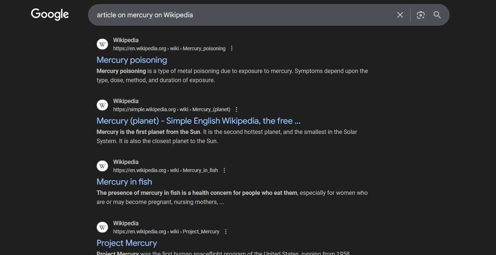

# Workflow Guide

> Auto-generated using Gemini Flash 2.0 AI Analysis
>
> **Task**: open a article on mercury on Wikipedia
>
> **Captured**: 2025-11-05T17:56:16.446943

---

## Essential Context

### Initial Setup
- **Application**: Google Search
- **Starting URL**: `https://www.google.com/`
- **Authentication**: No login required (public access)

### Complete Workflow Path
1. Navigate to the Google search homepage.
2. Type the search query "article on mercury on Wikipedia" into the search box.
3. Click the Google Search button.
4. Click the link for the Wikipedia article "Mercury (planet)".

---

## Detailed Workflow Steps

### Step 1: Navigate to Google Homepage

- **Action**: Navigate the browser to the Google homepage.
- **URL**: `https://www.google.com/`

### Step 2: Type Search Query

- **Action**: Type "article on mercury on Wikipedia" into the search input field (element index 2).
- **URL**: `https://www.google.com/`

### Step 3: Click Google Search Button

- **Action**: Click the Google Search button (element index 444).
- **URL**: `https://www.google.com/search?q=article+on+mercury+on+Wikipedia&sclient=gws-wiz`
- **Screenshot**: 

### Step 4: Click Wikipedia Article Link

- **Action**: Click the link for the Wikipedia article "Mercury (planet)" (element index 5077).
- **URL**: `https://www.google.com/search?q=article+on+mercury+on+Wikipedia&sclient=gws-wiz`
- **Screenshot**: 

---

## Workflow Summary

The agent successfully navigated to Google, searched for "article on mercury on Wikipedia", and clicked the first relevant search result to open the Wikipedia article about the planet Mercury.

- **Total Steps**: 4
- **Key Actions**: Navigate to Google, Input search query, Submit search, Click Wikipedia link

---

## Technical Details

- **Architecture**: Browser-Use autonomous agent v0.9.5
- **AI Models**: Claude Sonnet 4.5 (execution) + Gemini Flash 2.0 (guide generation)
- **Metadata**: See `metadata.json` for technical details
- **Workflow Version**: 1.0

Generated by [Flow Planner](https://github.com/your-repo/flow-planner)

---

## Refinement Information

This guide has been enhanced using Vision AI to validate and crop screenshots for clarity.

- **Refined Screenshots**: 2/2
- **Refinement Date**: 2025-11-05 18:01:43
- **Models Used**: gemini

### Refinement Details

| Step | Original | Refined | Valid | Grid Location |
|------|----------|---------|-------|---------------|
| 2 | step_002.png | step_001_refined.png | Yes | [(2, 1), (2, 2), (2, 3)] |
| 4 | step_004.png | step_003_refined.png | Yes | [(1, 1), (2, 1), (2, 2)] |
