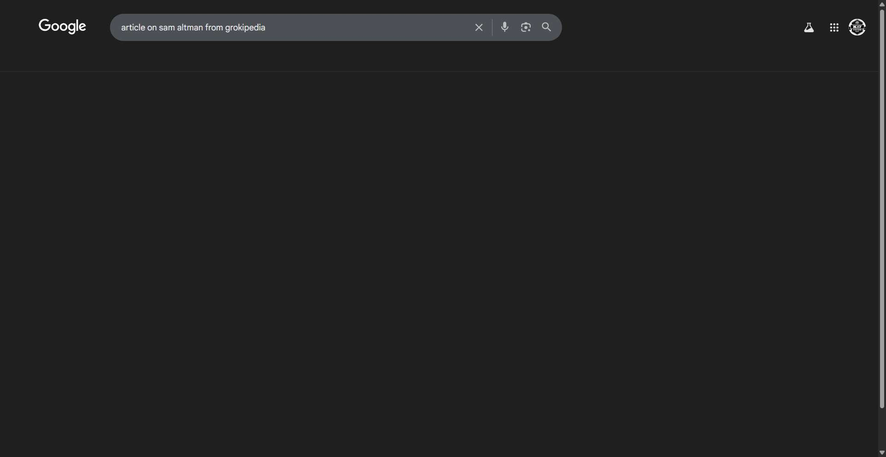

# Workflow Guide

> Auto-generated using Gemini Flash 2.0 AI Analysis
>
> **Task**: article on sam altman from grokipedia
>
> **Captured**: 2025-11-04T01:48:08.592285

---

## Essential Context

### Initial Setup
- **Application**: Google Search Engine
- **Starting URL**: `https://www.google.com/`
- **Authentication**: No login required (public access)

### Complete Workflow Path
1. Navigate to Google Search.
2. Input the search query "article on sam altman from grokipedia" into the search box.
3. Initiate the search by pressing Enter.

---

## Detailed Workflow Steps

### Step 1: Navigate to Google Homepage

- **Action**: Navigate to the Google homepage.
- **URL**: `https://www.google.com/`

### Step 2: Input Search Query and Initiate Search

- **Action**: Type "article on sam altman from grokipedia" into the search box and send the Enter key.
- **URL**: `https://www.google.com/`
- **Screenshot**: 

---

## Workflow Summary

The agent navigated to the Google search engine homepage. The agent then typed the required search query, "article on sam altman from grokipedia," into the search input field and initiated the search by pressing Enter, successfully setting up the next step of retrieving the article information.

- **Total Steps**: 2
- **Key Actions**: Navigate to Google, Type search query, Send Enter key

---

## Technical Details

- **Architecture**: Browser-Use autonomous agent v0.9.5
- **AI Models**: Claude Sonnet 4.5 (execution) + Gemini Flash 2.0 (guide generation)
- **Metadata**: See `metadata.json` for technical details
- **Workflow Version**: 1.0

Generated by [Flow Planner](https://github.com/your-repo/flow-planner)
