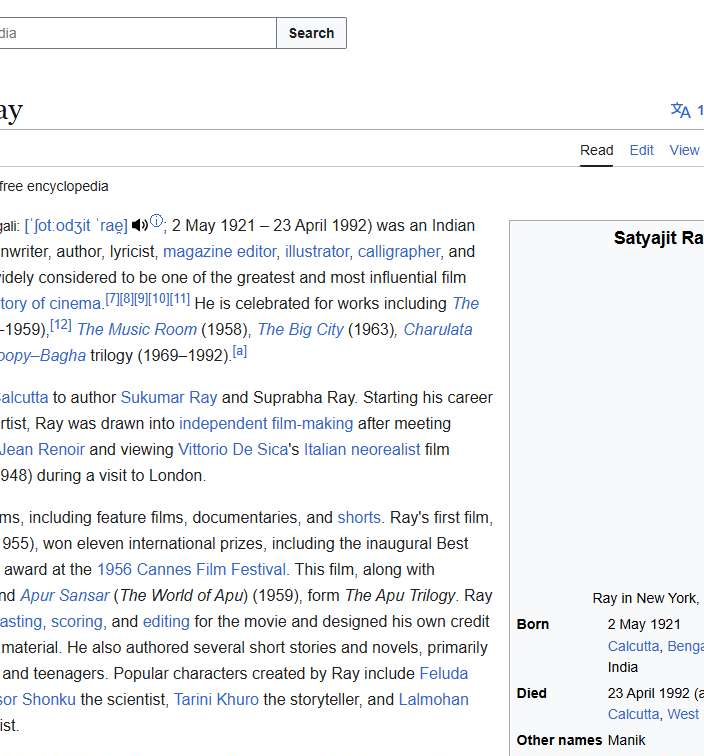

# Workflow Guide

> Auto-generated using Gemini Flash 2.0 AI Analysis
>
> **Task**: Open a article on Satyajit Ray on WIkipedia
>
> **Captured**: 2025-11-05T20:53:36.039087

---

## Essential Context

### Initial Setup
- **Application**: Google Search
- **Starting URL**: `https://www.google.com/`
- **Authentication**: No login required (public access)

### Complete Workflow Path
1. Navigate to the Google homepage.
2. Type "Satyajit Ray Wikipedia" into the search input field.
3. Click the Google Search button.
4. Click the link for the Satyajit Ray Wikipedia article from the search results.
5. Verify the Satyajit Ray Wikipedia article page has loaded.

---

## Detailed Workflow Steps

### Step 1: Navigate to Google Homepage

- **Action**: Navigate to `https://www.google.com/`
- **URL**: `https://www.google.com/`

### Step 2: Type Search Query into Search Box

- **Action**: Type "Satyajit Ray Wikipedia" into the search input field (index 1)
- **URL**: `https://www.google.com/`

### Step 3: Click the Google Search Button

- **Action**: Click the Google Search button (index 427)
- **URL**: `https://www.google.com/search?q=Satyajit+Ray+Wikipedia&sclient=gws-wiz`

### Step 4: Click the Wikipedia Search Result Link

- **Action**: Click the link labeled "Satyajit Ray Wikipedia https:/..." (index 5190)
- **URL**: `https://www.google.com/search?q=Satyajit+Ray+Wikipedia&sclient=gws-wiz`
- **Screenshot**: 

### Step 5: Verify Article Loading

- **Action**: Verify the displayed URL starts with `https://en.wikipedia.org/wiki/Satyajit_Ray`
- **URL**: `https://en.wikipedia.org/wiki/Satyajit_Ray`

---

## Workflow Summary

The agent successfully opened the Satyajit Ray article on Wikipedia by first navigating to Google, searching for the specific term, selecting the primary Wikipedia result from the search page, and finally verifying the successful navigation to the Wikipedia article URL.

- **Total Steps**: 5
- **Key Actions**: Navigate to Google, Search for "Satyajit Ray Wikipedia", Click search result, Verify Wikipedia article loaded.

---

## Technical Details

- **Architecture**: Browser-Use autonomous agent v0.9.5
- **AI Models**: Claude Sonnet 4.5 (execution) + Gemini Flash 2.0 (guide generation)
- **Metadata**: See `metadata.json` for technical details
- **Workflow Version**: 1.0

Generated by [Flow Planner](https://github.com/your-repo/flow-planner)

---

## Refinement Information

This guide has been enhanced using Vision AI to validate and crop screenshots for clarity.

- **Refined Screenshots**: 2/2
- **Refinement Date**: 2025-11-05 20:54:37
- **Models Used**: gemini

### Refinement Details

| Step | Original | Refined | Valid | Grid Location |
|------|----------|---------|-------|---------------|
| 2 | step_002.png | step_002_refined.png | Yes | [(1, 1), (1, 2)] |
| 4 | step_004.png | step_004_refined.png | Yes | [(1, 2), (2, 2)] |
