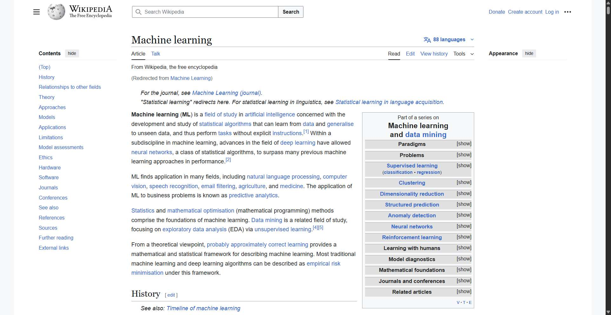

# Workflow Guide

> Auto-generated using Gemini Flash 2.0 AI Analysis
>
> **Task**: Search for 'Machine Learning' on Wikipedia, return first article
>
> **Captured**: 2025-11-02T16:47:06.150179

---

# Workflow Guide: Searching for 'Machine Learning' on Wikipedia

This guide details the steps taken to successfully search for 'Machine Learning' on Wikipedia and navigate to the resulting first article.

**Original Task**: Search for 'Machine Learning' on Wikipedia, return first article

**Workflow Summary**: 3 Steps, 3 Successful Steps. The process involved navigating to the Wikipedia homepage, executing a search, and being automatically redirected to the main 'Machine Learning' article.

---

## Step-by-Step Execution

### Step 1: Navigate to Wikipedia Homepage

The process began by navigating directly to the main Wikipedia portal.

| Detail | Description |
| :--- | :--- |
| **Action** | Navigated to `https://www.wikipedia.org` |
| **URL** | `https://www.wikipedia.org` |
| **Notes** | This initial navigation sets the stage for the subsequent search action. |

### Step 2: Input Search Query and Submit

On the Wikipedia homepage, the agent located the search input field (which was dynamically loaded, potentially within a shadow DOM), entered the search term, and clicked the search button.

| Detail | Description |
| :--- | :--- |
| **Action** | Input 'Machine Learning' into the search field (index 4) and clicked the 'Search' button (index 543). |
| **URL** | `https://www.wikipedia.org/` |
| **Notes** | The agent successfully interacted with the search form elements to initiate the query. |

### Step 3: Access and Confirm Article Page (Task Completion)

Upon submitting the search, Wikipedia's internal mechanism recognized the query as an exact match for a primary article and automatically redirected the agent away from the search results page directly to the article.

| Detail | Description |
| :--- | :--- |
| **Action** | Agent confirmed successful navigation to the 'Machine Learning' article page. The task was marked as complete. |
| **URL** | The final URL was `https://en.wikipedia.org/wiki/Machine_Learning` |
| **Notes** | The workflow steps designed to identify a search result link and click it were bypassed because of the direct article redirection, leading to immediate task success. |

---

## Final Summary

The workflow was executed successfully in 3 steps, achieving the goal of accessing the first article related to 'Machine Learning' on Wikipedia.

**Outcome**: The agent landed directly on the primary article: **Machine learning - Wikipedia** (`https://en.wikipedia.org/wiki/Machine_Learning`).

**Key Observation**: For exact matches on Wikipedia's search, the system typically redirects immediately to the article rather than displaying a list of search results, streamlining the process.

---

## Technical Details

- **Architecture**: Browser-Use autonomous agent v0.9.5
- **AI Models**: Claude Sonnet 4.5 (execution) + Gemini Flash 2.0 (guide generation)
- **Metadata**: See `metadata.json` for technical details
- **Workflow Version**: 1.0

Generated by [Flow Planner](https://github.com/your-repo/flow-planner)
