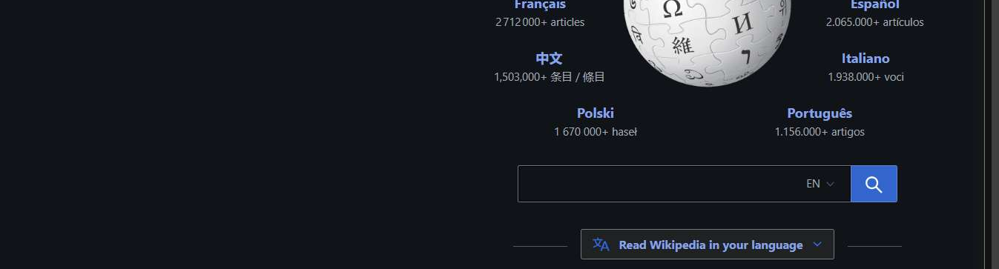

# Workflow Guide

> Auto-generated using Gemini Flash 2.0 AI Analysis
>
> **Task**: share the first article on Quantam mechanics on Wikipedia
>
> **Captured**: 2025-11-04T02:00:05.908997

---

## Essential Context

### Initial Setup
- **Application**: Wikipedia (Portal Page)
- **Starting URL**: `https://www.wikipedia.org/`
- **Authentication**: No login required (public access)

### Complete Workflow Path
1. Navigate to Wikipedia.org.
2. Input "Quantum mechanics" into the search field.
3. Submit the search.
4. Navigate to the first search result for the "Quantum mechanics" article.
5. Extract and report the URL of the article.

---

## Detailed Workflow Steps

### Step 1: Navigate to Wikipedia Portal Page

- **Action**: Navigate to `https://www.wikipedia.org/`
- **URL**: `https://www.wikipedia.org/`

### Step 2: Input Search Term and Submit Search

- **Action**: Type "Quantum mechanics" into the search input field (index 4) and click the search button (index 541).
- **URL**: `https://www.wikipedia.org/`
- **Screenshot**: 

---

## Workflow Summary

The agent navigated to the Wikipedia portal, entered "Quantum mechanics" into the search bar, and submitted the search query to locate the relevant article. The next steps would involve navigating to the top result and extracting the final URL to complete the task.

- **Total Steps**: 2
- **Key Actions**: Navigate to Wikipedia, Type search query, Submit search.

---

## Technical Details

- **Architecture**: Browser-Use autonomous agent v0.9.5
- **AI Models**: Claude Sonnet 4.5 (execution) + Gemini Flash 2.0 (guide generation)
- **Metadata**: See `metadata.json` for technical details
- **Workflow Version**: 1.0

Generated by [Flow Planner](https://github.com/your-repo/flow-planner)

---

## Refinement Information

This guide has been enhanced using Vision AI to validate and crop screenshots for clarity.

- **Refined Screenshots**: 1/1
- **Refinement Date**: 2025-11-04 02:01:14
- **Models Used**: gemini

### Refinement Details

| Step | Original | Refined | Valid | Grid Location |
|------|----------|---------|-------|---------------|
| 2 | step_002.png | step_002_refined.png | Yes | [(2, 1), (2, 2)] |
