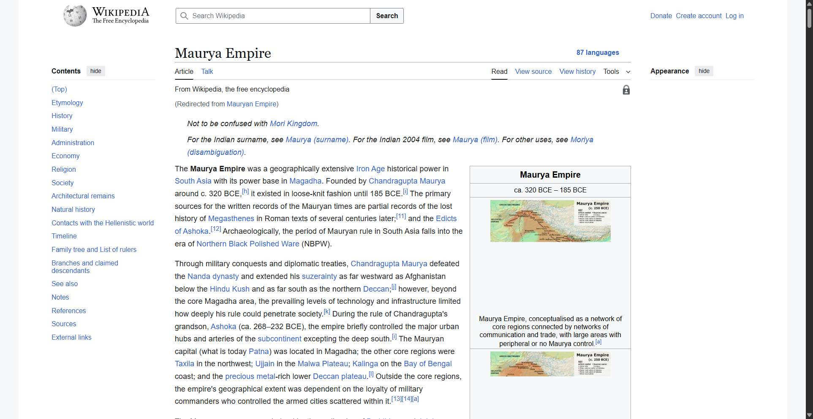
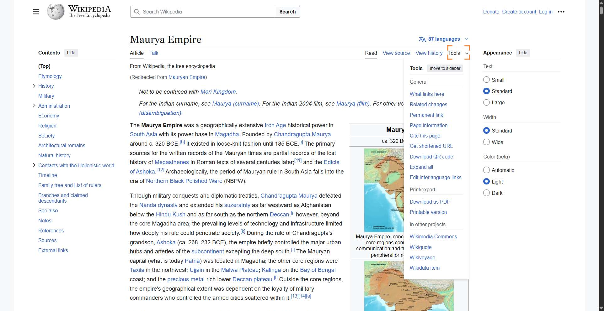
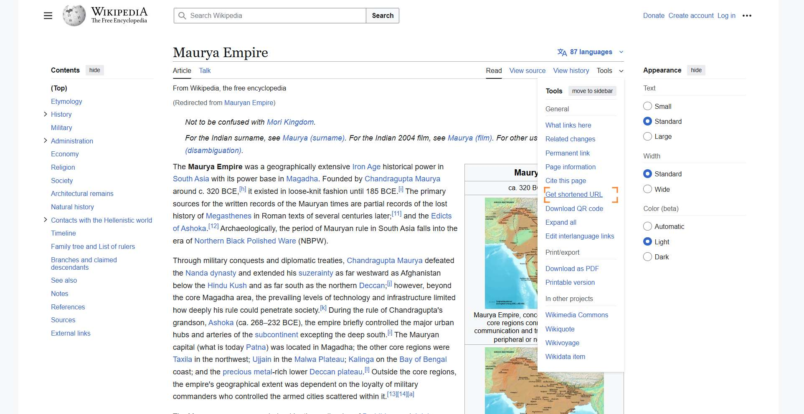

# Workflow Guide

> Auto-generated using Gemini Flash 2.0 AI Analysis
>
> **Task**: share the article on mauryan empire on India on wikipedia
>
> **Captured**: 2025-11-04T02:11:04.831365

---

## Essential Context

### Initial Setup
- **Application**: Wikipedia
- **Starting URL**: `https://www.wikipedia.org/`
- **Authentication**: No login required (public access)

### Complete Workflow Path
1. Navigate to the Wikipedia homepage.
2. Search for the "Mauryan Empire" article.
3. Navigate to the correct article page.
4. Locate and open the 'Tools' menu on the article page.
5. Select the 'Get shortened URL' option to generate a shareable link.
6. Close the resulting dialog box.

---

## Detailed Workflow Steps

### Step 1: Navigate to Wikipedia Homepage

- **Action**: Navigate to the Wikipedia homepage.
- **URL**: `https://www.wikipedia.org/`

### Step 2: Search for "Mauryan Empire" and Submit Search

- **Action**: Type "Mauryan Empire" into the search input field (index 4) and click the Search button (index 541).
- **URL**: `https://www.wikipedia.org/`
- **Screenshot**: 

### Step 3: Navigate to Maurya Empire Article

- **Action**: Navigate to the Maurya Empire Wikipedia article page.
- **URL**: `https://en.wikipedia.org/wiki/Maurya_Empire`

### Step 4: Click the Tools Dropdown Menu

- **Action**: Click on the 'Tools' dropdown label (element 5184) to reveal sharing options.
- **URL**: `https://en.wikipedia.org/wiki/Maurya_Empire`
- **Screenshot**: 

### Step 5: Select the "Get shortened URL" Option

- **Action**: Click the "Get shortened URL" option (element 5229) from the expanded Tools menu.
- **URL**: `https://en.wikipedia.org/wiki/Maurya_Empire`
- **Screenshot**: 

### Step 6: Close the Shortened URL Dialog

- **Action**: Click the "OK" button (index 21533) to close the dialog displaying the shortened URL.
- **URL**: `https://en.wikipedia.org/wiki/Maurya_Empire`

---

## Workflow Summary

The agent successfully navigated to the Wikipedia homepage, searched for the "Mauryan Empire," and located the article page. The agent then accessed the 'Tools' menu, selected the option to get a shortened URL, and observed the resulting shareable link (`https://w.wiki/3kNc`) before closing the confirmation dialog. The task of obtaining a shareable link for the article is complete.

- **Total Steps**: 6
- **Key Actions**: Navigate to Wikipedia, Search for "Mauryan Empire", Click Tools menu, Select "Get shortened URL", Close confirmation dialog.

---

## Technical Details

- **Architecture**: Browser-Use autonomous agent v0.9.5
- **AI Models**: Claude Sonnet 4.5 (execution) + Gemini Flash 2.0 (guide generation)
- **Metadata**: See `metadata.json` for technical details
- **Workflow Version**: 1.0

Generated by [Flow Planner](https://github.com/your-repo/flow-planner)
