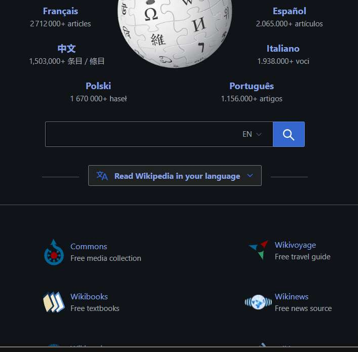
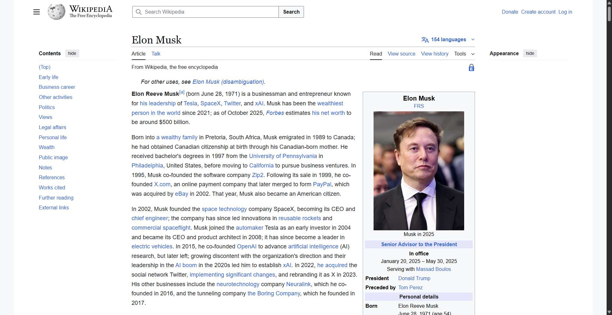

# Workflow Guide

> Auto-generated using Gemini Flash 2.0 AI Analysis
>
> **Task**: Open an article on Elon Musk on wikipedia
>
> **Captured**: 2025-11-04T11:46:34.309582

---

## Essential Context

### Initial Setup
- **Application**: Wikipedia
- **Starting URL**: `https://www.wikipedia.org/`
- **Authentication**: No login required (public access)

### Complete Workflow Path
1. Navigate to the Wikipedia main page.
2. Input "Elon Musk" into the search field and submit the search.
3. Click the link for the "Elon Musk" Wikipedia article.

---

## Detailed Workflow Steps

### Step 1: Navigate to Wikipedia

- **Action**: Navigate to the Wikipedia main page.
- **URL**: `https://www.wikipedia.org/`

### Step 2: Search for "Elon Musk"

- **Action**: Type "Elon Musk" into the search input field (element 4 within the shadow DOM) and click the search button (element 540).
- **URL**: `https://www.wikipedia.org/`
- **Screenshot**: 

### Step 3: Click the Elon Musk Article Link

- **Action**: Click the link titled "Elon Musk".
- **URL**: `https://en.wikipedia.org/wiki/Elon_Musk`
- **Screenshot**: 

---

## Workflow Summary

The agent navigated to the Wikipedia homepage, entered "Elon Musk" into the search bar, executed the search, and successfully clicked the resulting link to open the main article about Elon Musk.

- **Total Steps**: 3
- **Key Actions**: Navigate to Wikipedia, Search for "Elon Musk", Click article link.

---

## Technical Details

- **Architecture**: Browser-Use autonomous agent v0.9.5
- **AI Models**: Claude Sonnet 4.5 (execution) + Gemini Flash 2.0 (guide generation)
- **Metadata**: See `metadata.json` for technical details
- **Workflow Version**: 1.0

Generated by [Flow Planner](https://github.com/your-repo/flow-planner)

---

## Refinement Information

This guide has been enhanced using Vision AI to validate and crop screenshots for clarity.

- **Refined Screenshots**: 1/1
- **Refinement Date**: 2025-11-04 11:46:44
- **Models Used**: gemini

### Refinement Details

| Step | Original | Refined | Valid | Grid Location |
|------|----------|---------|-------|---------------|
| 2 | step_002.png | step_002_refined.png | Yes | [(2, 2), (3, 2)] |
