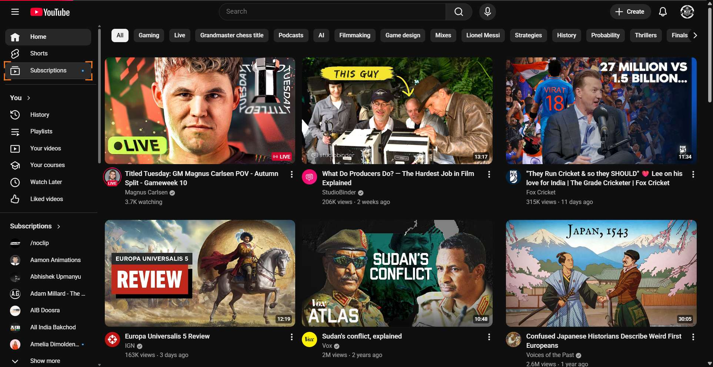
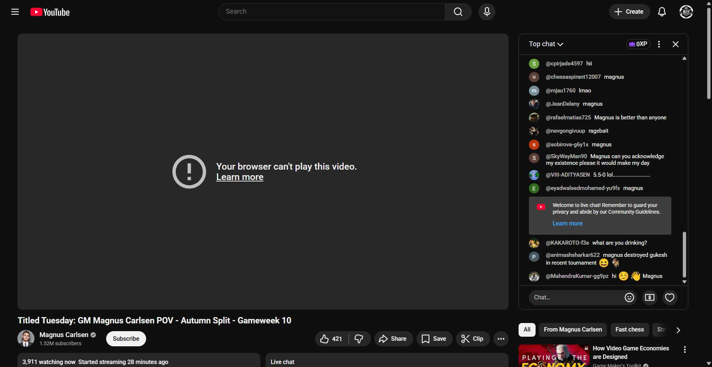
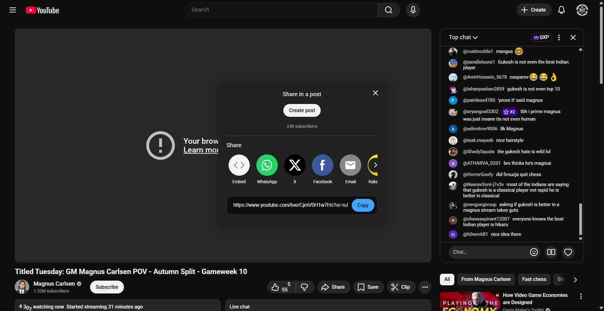

- # Workflow Guide

> Auto-generated using Gemini Flash 2.0 AI Analysis
>
> **Task**: share the first video of subscribed section from Youtube
>
> **Captured**: 2025-11-04T11:33:23.744421

---

## Essential Context

### Initial Setup
- **Application**: YouTube
- **Starting URL**: `https://www.youtube.com/`
- **Authentication**: Already logged in (persistent session detected)

### Complete Workflow Path
1. Navigate to the YouTube homepage.
2. Click the "Subscriptions" link in the navigation menu.
3. Click the first video displayed on the subscriptions feed.
4. Click the "Share" button on the video page.
5. Retrieve the shareable link provided by the share dialog.

---

## Detailed Workflow Steps

### Step 1: Navigate to the YouTube Homepage

- **Action**: Ensure the browser is on the main YouTube homepage.
- **URL**: `https://www.youtube.com/`

### Step 2: Click the Subscriptions Link

- **Action**: Click the role link labeled "Subscriptions" in the navigation panel.
- **URL**: `https://www.youtube.com/`
- **Screenshot**: 

### Step 3: Click the First Video in the Subscriptions Feed

- **Action**: Click the link for the first video displayed in the subscriptions feed (titled "Titled Tuesday: GM Magnus Carlsen POV - Autumn Split - Gameweek 10").
- **URL**: `https://www.youtube.com/feed/subscriptions`
- **Screenshot**: 

### Step 4: Click the Share Button on the Video Page

- **Action**: Click the button labeled "Share" located beneath the video player.
- **URL**: `https://www.youtube.com/watch?v=CjmV0H1w7Hs`
- **Screenshot**: 

### Step 5: Retrieve the Shareable Link

- **Action**: Copy the URL displayed in the share dialog box.
- **URL**: `https://www.youtube.com/watch?v=CjmV0H1w7Hs`

---

## Workflow Summary

The agent successfully navigated to the YouTube homepage, accessed the subscriptions feed, and selected the first available video. After loading the video page, the agent clicked the Share button and copied the resulting shareable link to complete the task.

- **Total Steps**: 5
- **Key Actions**: Navigate to YouTube, Click Subscriptions, Click First Video, Click Share, Copy Link.

---

## Technical Details

- **Architecture**: Browser-Use autonomous agent v0.9.5
- **AI Models**: Claude Sonnet 4.5 (execution) + Gemini Flash 2.0 (guide generation)
- **Metadata**: See `metadata.json` for technical details
- **Workflow Version**: 1.0

Generated by [Flow Planner](https://github.com/your-repo/flow-planner)
