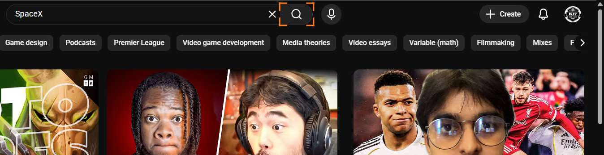
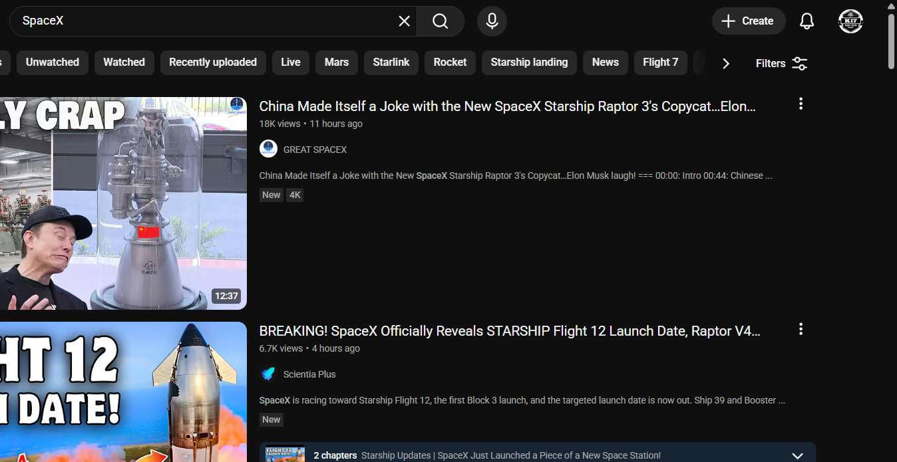
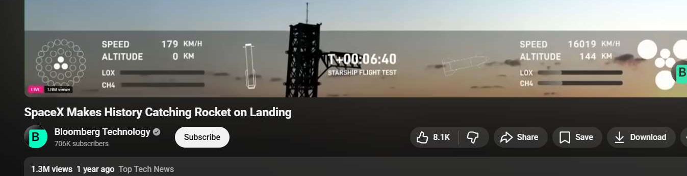
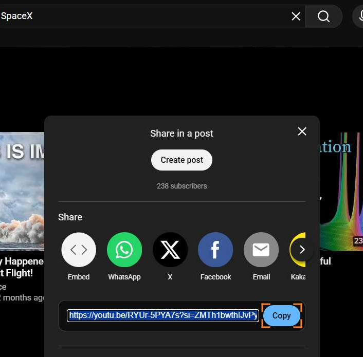

# Workflow Guide

> Auto-generated using Gemini Flash 2.0 AI Analysis
>
> **Task**: Share a youtube video on SpaceX
>
> **Captured**: 2025-11-05T17:42:51.024120

---

## Essential Context

### Initial Setup
- **Application**: YouTube
- **Starting URL**: `https://www.youtube.com/`
- **Authentication**: No login required (public access)

### Complete Workflow Path
1. Navigate to the YouTube homepage.
2. Type "SpaceX" into the search bar.
3. Click the search button.
4. Click on the first relevant SpaceX video result.
5. Click the "Share" button below the video player.
6. Click the "Copy" button within the sharing modal to copy the video link.

---

## Detailed Workflow Steps

### Step 1: Navigate to the YouTube homepage

- **Action**: Navigate browser to `https://www.youtube.com/`
- **URL**: `https://www.youtube.com/`

### Step 2: Type "SpaceX" into the search bar

- **Action**: Type "SpaceX" into the search input field element identified by index 1299
- **URL**: `https://www.youtube.com/`

### Step 3: Click the search button

- **Action**: Click the search button element identified by index 1304
- **URL**: `https://www.youtube.com/`
- **Screenshot**: 

### Step 4: Click on the first relevant SpaceX video result

- **Action**: Click the video link element identified by index 13665 (corresponding to "SpaceX Makes History Catching Rocket on Landing")
- **URL**: `https://www.youtube.com/results?search_query=SpaceX`
- **Screenshot**: 

### Step 5: Click the "Share" button below the video player

- **Action**: Click the "Share" button element identified by index 32229
- **URL**: `https://www.youtube.com/watch?v=RYUr-5PYA7s`
- **Screenshot**: 

### Step 6: Click the "Copy" button within the sharing modal

- **Action**: Click the "Copy" button element identified by index 38479
- **URL**: `https://www.youtube.com/watch?v=RYUr-5PYA7s`
- **Screenshot**: 

---

## Workflow Summary

The agent successfully navigated to YouTube, searched for "SpaceX," selected a video titled "SpaceX Makes History Catching Rocket on Landing," opened the sharing options modal, and clicked the "Copy" button to capture the video link. This completes the task of sharing the YouTube video link.

- **Total Steps**: 6
- **Key Actions**: Navigate to YouTube, Search for "SpaceX," Open Video, Click Share, Copy Link

---

## Technical Details

- **Architecture**: Browser-Use autonomous agent v0.9.5
- **AI Models**: Claude Sonnet 4.5 (execution) + Gemini Flash 2.0 (guide generation)
- **Metadata**: See `metadata.json` for technical details
- **Workflow Version**: 1.0

Generated by [Flow Planner](https://github.com/your-repo/flow-planner)

---

## Refinement Information

This guide has been enhanced using Vision AI to validate and crop screenshots for clarity.

- **Refined Screenshots**: 4/4
- **Refinement Date**: 2025-11-05 17:43:25
- **Models Used**: gemini

### Refinement Details

| Step | Original | Refined | Valid | Grid Location |
|------|----------|---------|-------|---------------|
| 3 | step_003.png | step_003_refined.png | Yes | [(1, 2), (1, 3)] |
| 5 | step_005.png | step_004_refined.png | Yes | [(1, 2), (1, 3), (2, 2), (2, 3)] |
| 7 | step_007.png | step_006_refined.png | Yes | [(3, 2), (3, 1)] |
| 9 | step_009.png | step_009_refined.png | Yes | [(1, 2), (2, 2)] |
